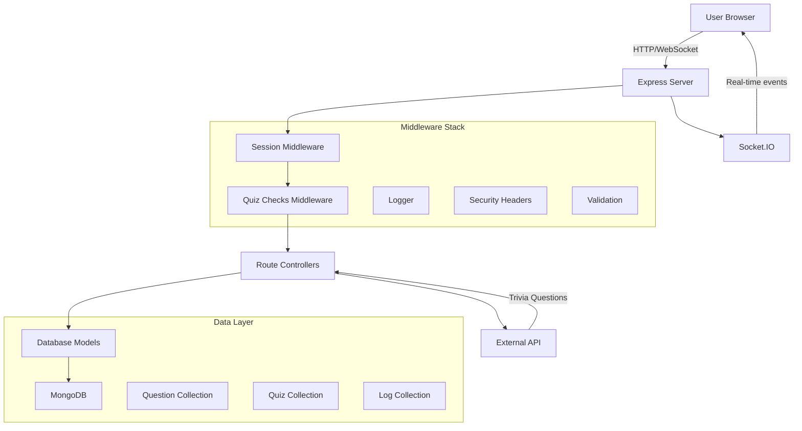
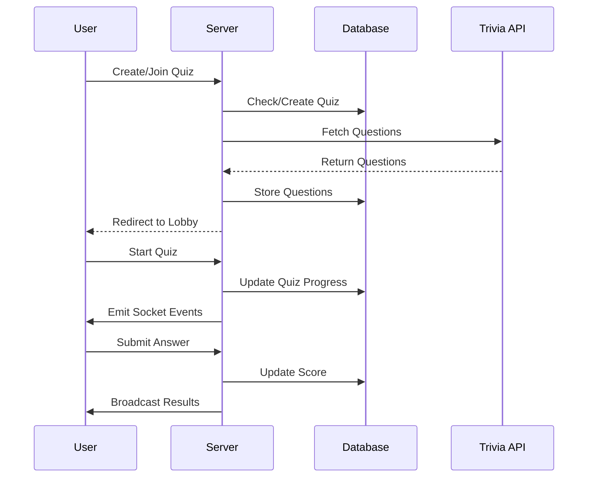
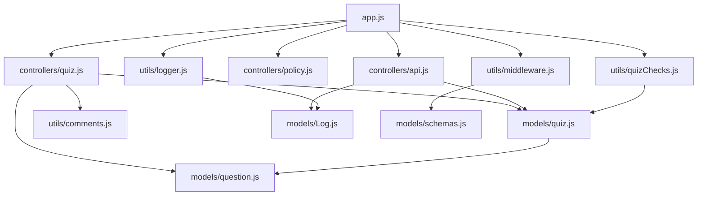

# ARCHITECTURE_REFERENCE.md

## System Overview

This is a **real-time multiplayer quiz web application** built with Node.js, Express, MongoDB, and Socket.IO. The application allows users to:

- Create or join quiz rooms using 4-digit codes
- Take quizzes with configurable difficulty and question counts
- Participate in real-time multiplayer sessions with synchronized progress
- View scores and performance feedback

The application follows a traditional MVC pattern with additional utility layers for security, validation, and real-time communication.

## Architecture Flow



### Request Flow Diagram



## File/Module Inventory

### Core Application Files

#### `app.js` - Main Application Entry Point

- **Purpose**: Express server setup and configuration
- **Key Responsibilities**:
  - Database connection (MongoDB via Mongoose)
  - Middleware configuration (security, session, validation)
  - Route registration
  - Socket.IO server initialization
- **Main Exports**: None (main entry point)

### Controllers Layer

#### `controllers/quiz.js` - Main Quiz Logic

- **Purpose**: Handle all quiz-related HTTP requests
- **Key Responsibilities**:
  - Quiz creation and joining logic
  - Lobby management
  - Quiz flow control
  - User management (kick, reset)
- **Main Functions**: `index`, `lobbyNewPost`, `lobbyJoinPost`, `lobby`, `quiz`, `finish`, `quizKickUserPatch`, `resetUserPatch`, `resetQuizDelete`

#### `controllers/api.js` - AJAX/Real-time API

- **Purpose**: Handle AJAX requests for real-time quiz functionality
- **Key Responsibilities**:
  - Quiz state transitions
  - Answer submission
  - Progress tracking
  - Admin logging API
- **Main Functions**: `quizCode`, `startQuiz`, `submitQuiz`, `showQuiz`, `nextQuiz`, `finishedQuiz`, `logs`

#### `controllers/policy.js` - Policy Pages

- **Purpose**: Handle legal/policy page requests
- **Key Responsibilities**:
  - Cookie policy display
  - Terms and conditions handling
- **Main Functions**: `cookiePolicy`, `tandc`, `tandcPost`

### Models Layer

#### `models/quiz.js` - Quiz Data Model

- **Purpose**: Define quiz schema and database operations
- **Key Responsibilities**:
  - Quiz metadata storage
  - User management within quizzes
  - Progress tracking
- **Schema Fields**: `quizCode`, `questions`, `quizMaster`, `users`, `progress`, `questionNumber`, `usersSubmitted`

#### `models/question.js` - Question Data Model

- **Purpose**: Define individual question schema
- **Key Responsibilities**:
  - Question content storage
  - Answer management
- **Schema Fields**: `category`, `difficulty`, `question`, `correctAnswer`, `incorrectAnswers`

#### `models/Log.js` - Analytics/Logging Model

- **Purpose**: Track user visits and analytics
- **Key Responsibilities**:
  - IP-based visitor tracking
  - Geographic data storage
  - Route access counting
- **Schema Fields**: `ip`, `country`, `city`, `timesVisited`, `lastVisitDate`, `lastVisitTime`, `routes`

#### `models/schemas.js` - Validation Schemas

- **Purpose**: Joi validation schemas for input sanitization
- **Key Responsibilities**:
  - HTML sanitization
  - Input validation rules
  - Security validation
- **Main Exports**: `lobbyNewSchema`, `lobbyJoinSchema`, `userDataSchema`, `tandcSchema`

### Utilities Layer

#### `utils/middleware.js` - Validation Middleware

- **Purpose**: Request validation and error handling
- **Key Responsibilities**:
  - Joi validation integration
  - Flash error messaging
  - Input sanitization
- **Main Functions**: `validateLobbyNew`, `validateLobbyJoin`, `validateUserData`, `validateTandC`

#### `utils/quizChecks.js` - Route Protection

- **Purpose**: Ensure users are in correct quiz state
- **Key Responsibilities**:
  - Route access control
  - User state validation
  - Quiz synchronization
- **Main Functions**: `quizChecks` (middleware)

#### `utils/logger.js` - Request Logging

- **Purpose**: Log all requests for analytics
- **Key Responsibilities**:
  - IP-based visitor tracking
  - Geographic location lookup
  - Route access counting
- **Main Functions**: `logger` (middleware)

#### `utils/catchAsync.js` - Async Error Wrapper

- **Purpose**: Wrap async route handlers for error handling
- **Key Responsibilities**:
  - Async error catching
  - Error forwarding to error handler

#### `utils/errorHandler.js` - Centralized Error Handling

- **Purpose**: Handle all application errors
- **Key Responsibilities**:
  - Error logging
  - User-friendly error pages
  - Error response formatting

#### `utils/ExpressError.js` - Custom Error Class

- **Purpose**: Structured error objects
- **Key Responsibilities**:
  - Error status codes
  - Error message handling

#### `utils/comments.js` - Score Comments

- **Purpose**: Generate performance feedback
- **Key Responsibilities**:
  - Score-based comment generation
  - User feedback messages

### Frontend Assets

#### `public/javascripts/` - Client-side Scripts

- **boilerplate.js**: Socket.IO setup and global functionality
- **quiz.js**: Quiz interaction logic
- **lobby.js**: Lobby real-time updates
- **index.js**: Homepage functionality
- **validateForms.js**: Client-side form validation

#### `views/` - EJS Templates

- **layouts/boilerplate.ejs**: Main layout template
- **quiz/**: Quiz-related pages (index, lobby, quiz, finish)
- **policy/**: Legal pages (cookie policy, T&Cs)
- **partials/**: Reusable components (flash messages)

## Dependency Map

### Core Dependencies



### Import Relationships

#### app.js (Entry Point)

- **Imports from**: All controllers, most utilities, models
- **Dependencies**: Express, Socket.IO, Mongoose, security middleware

#### Controllers

- **quiz.js**: Models (Quiz, Question), utils (comments), external API (axios)
- **api.js**: Models (Quiz, Log), crypto (for API authentication)
- **policy.js**: No model dependencies, uses flash messaging

#### Models

- **quiz.js**: Mongoose only
- **question.js**: Mongoose only
- **Log.js**: Mongoose only
- **schemas.js**: Joi, sanitize-html

#### Utilities

- **middleware.js**: schemas.js
- **quizChecks.js**: models/quiz.js
- **logger.js**: models/Log.js, micro-geoip-lite

### Entry Points

1. **HTTP Server**: `app.js` → Express routes → Controllers → Models
2. **WebSocket Server**: `app.js` → Socket.IO → Client-side JavaScript
3. **External API**: Controllers → Trivia API → Question storage

### Circular Dependencies

**No circular dependencies detected**. The architecture follows a clean layered approach:

- App.js imports all lower layers
- Controllers import models and utilities
- Models have no internal dependencies
- Utilities import models only when necessary

## Data Flow

### User Registration Flow

1. **Input**: User submits username and quiz preferences
2. **Validation**: middleware.js sanitizes and validates input
3. **Processing**: quiz.js controller creates unique quiz code
4. **External API**: Fetches questions from trivia API
5. **Database**: Stores quiz metadata and questions
6. **Session**: Creates user session with quiz data
7. **Response**: Redirects to lobby with flash message

### Multiplayer Quiz Flow

1. **Join**: User enters quiz code → validation → quiz lookup → user addition
2. **Real-time**: Socket.IO broadcasts user joins/leaves
3. **Start**: Quiz master triggers start → state update → Socket.IO broadcast
4. **Questions**: Synchronized question progression via API calls
5. **Answers**: AJAX submission → score calculation → real-time updates
6. **Completion**: Results aggregation → display scores

### Data Persistence

- **Sessions**: MongoDB via connect-mongo
- **Quiz Data**: Quiz and Question collections
- **Analytics**: Log collection with IP tracking
- **External**: Questions fetched from trivia API, then cached locally

## Key Interactions

### Quiz Creation Interaction

```
controllers/quiz.js:lobbyNewPost
→ models/quiz.js (Quiz.create)
→ external API (axios)
→ models/question.js (Question.create)
→ session storage
```

### Real-time Answer Submission

```
public/javascripts/quiz.js
→ controllers/api.js:submitQuiz
→ models/quiz.js (Quiz.updateOne)
→ Socket.IO emit
→ other clients update
```

### User State Validation

```
Every request
→ utils/quizChecks.js
→ models/quiz.js (Quiz.findOne)
→ session validation
→ redirect if needed
```

### Security Validation Chain

```
Request
→ utils/middleware.js (Joi validation)
→ mongoSanitize
→ helmet headers
→ controller processing
```

## Extension Points

### Adding New Quiz Features

**Files to modify**:

- `models/quiz.js` - Add new schema fields
- `controllers/quiz.js` - Add new route handlers
- `controllers/api.js` - Add AJAX endpoints
- `public/javascripts/quiz.js` - Add client-side logic
- `views/quiz/` - Add new EJS templates

### Adding New Question Types

**Files to modify**:

- `models/question.js` - Extend schema for new types
- `controllers/quiz.js` - Update question handling
- `public/javascripts/quiz.js` - Add rendering logic
- External API integration may need updates

### Adding New Analytics

**Files to modify**:

- `models/Log.js` - Add new tracking fields
- `utils/logger.js` - Add new logging logic
- `controllers/api.js` - Add new analytics endpoints

### Adding New User Roles

**Files to modify**:

- `models/quiz.js` - Add role field to users array
- `utils/quizChecks.js` - Add role-based access control
- `controllers/quiz.js` - Add role-specific logic
- `views/` - Add role-based UI elements

### Security Enhancements

**Files to modify**:

- `utils/middleware.js` - Add new validation rules
- `app.js` - Add new security middleware
- `models/schemas.js` - Add new validation schemas

### Database Schema Changes

**Files to modify**:

- Relevant model files in `models/`
- Controllers that use the modified models
- Validation schemas in `models/schemas.js`
- Migration scripts may be needed for existing data

### API Extensions

**Files to modify**:

- `controllers/api.js` - Add new endpoints
- `utils/middleware.js` - Add new validation
- Frontend JavaScript files for API consumption
- Documentation updates

The architecture is designed to be modular and extensible, with clear separation of concerns between data models, business logic, presentation, and utility functions.
