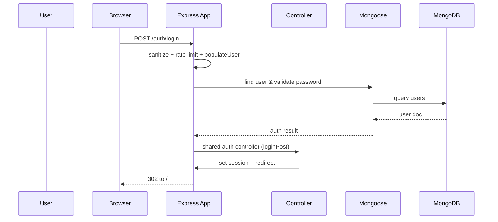

# Architecture Reference - Longrunner Platform

This document keeps a birds-eye view of the `longrunner-platform` pnpm workspace that now hosts the `ironman-blog` and `shoppinglist` apps plus shared workspaces under `packages/@longrunner`. Everything runs as ES modules, reuses shared controllers, middleware, schemas, and serves the shared auth/policy views from the shared packages so that the apps remain focused on their domain logic.

## Table of Contents
1. [System Overview](#system-overview)
2. [Architecture Flow](#architecture-flow)
3. [File/Module Inventory](#filemodule-inventory)
4. [Dependency Map](#dependency-map)
5. [Data Flow](#data-flow)
6. [Key Interactions](#key-interactions)
7. [Extension Points](#extension-points)

---

## System Overview

| App | Directory | Port | Focus |
|-----|-----------|------|-------|
| `ironman-blog` | `apps/blog` | 3004 | Ironman training blog, reviews, admin moderation, IP tracking. |
| `shoppinglist` | `apps/slapp` | 3001 | Meal planner, ingredient catalog, weekly shopping list generator. |

### Shared Workspace Packages
- `@longrunner/shared-auth` – user schema factory, bcrypt password helpers, and reusable auth controllers that plug into each app's `User` model and session system.
- `@longrunner/shared-policy` – policy/cookie controllers, shared policy views, and static assets mounted under `/stylesheets/shared-policy` and `/javascripts/shared-policy`.
- `@longrunner/shared-middleware` – validation middleware generators plus `isLoggedIn` / `populateUser` helpers powered by shared Joi schemas.
- `@longrunner/shared-schemas` – Joi schema collection (auth, reviews, meals, ingredients, shopping lists), includes a custom `escapeHTML` string extension.
- `@longrunner/shared-config` – helpers for building MongoDB URLs, session configs, and Helmet CSP settings.
- `@longrunner/shared-utils` – rate limiters, flash middleware, ExpressError, centralized error handler, mailer, and `catchAsync`.

### Core Technologies
- `express@5.x` running as the web framework with middleware chains in each `app.js`.
- `mongoose` ODM talking to per-app MongoDB databases (`blog`, `slapp`).
- `pnpm` workspaces with `type": "module"` packages.
- `EJS` templating (with `ejs-mate`) and shared EJS partials/views from `shared-auth` and `shared-policy`.
- Authentication via session cookies (MongoStore) + bcrypt/hash migration.
- Security stack: `helmet` (with CSP from `shared-config`), `express-mongo-sanitize`, `compression`, `express-rate-limit`, `express-recaptcha`, `sanitize-html`.
- Mail delivery via Zoho SMTP configured in `@longrunner/shared-utils/mail.js`.
- Environment variables: `MONGODB`, `SESSION_KEY`, `SITEKEY`, `SECRETKEY`, `EMAIL_USER`, `ALIAS_EMAIL`, `ZOHOPW`, plus `DEFAULT_USER_ID` for seeding on registration.

Verification: prefer `pnpm --filter ironman-blog lint` or `pnpm --filter shoppinglist lint` after edits and start apps with `pnpm --filter <app> exec node app.js`.

---

## Architecture Flow

### HTTP request lifecycle (common pattern)

```mermaid
flowchart LR
    Client[Browser / API client]
    BlogApp[apps/blog/app.js]
    SlappApp[apps/slapp/app.js]
    SharedMiddleware[/utils + shared packages/]
    SharedAuth[@longrunner/shared-auth]
    SharedPolicy[@longrunner/shared-policy]
    SharedConfig[@longrunner/shared-config]
    SharedUtils[@longrunner/shared-utils]
    SharedMiddleware --> SharedConfig
    SubControllers[controllers/ + models/]
    Database[(MongoDB)]
    Views[EJS views + shared partials]

    Client -->|HTTP / forms / AJAX| BlogApp
    Client -->|HTTP / forms / AJAX| SlappApp

    BlogApp --> SharedConfig
    SlappApp --> SharedConfig
    BlogApp --> SharedUtils
    SlappApp --> SharedUtils
    BlogApp --> SharedAuth
    SlappApp --> SharedAuth
    BlogApp --> SharedPolicy
    SlappApp --> SharedPolicy

    BlogApp --> SubControllers
    SlappApp --> SubControllers
    SubControllers --> Database
    SubControllers --> SharedUtils
    SubControllers --> Views
    Views --> Client
    Database --> SharedUtils
```

Each `app.js` boots `express`, resolves shared view roots, serves static assets from both local `public/` and `shared-*` packages, sanitizes inputs, mounts session/cookie helpers, registers Recaptcha for `/policy/tandc`, wires rate limiters, and then wires routes for shared auth plus app-specific controllers.

Shared assets are served with explicit prefixes (`/stylesheets/shared-auth`, `/javascripts/shared-auth`, `/stylesheets/shared-policy`, `/javascripts/shared-policy`), so the apps can render the shared templates without copying them.

---

## File/Module Inventory

### `apps/blog`
- `app.js` – entry point (port 3004). Imports shared config/middleware/auth/policy, configures MongoStore sessions, helmet CSP, compression, Recaptcha, general/auth/forgot rate limiters, and wires the blog routes. Sets multi-root views array to include shared auth/policy templates.
- `controllers/`
  - `users.js` – wraps `@longrunner/shared-auth/controllers` for blog-specific `onDelete` cleanup (removes `Review` docs) and exposes the standard register/login/forgot/reset/details/delete handlers.
  - `blogsIM.js` – renders blog home and detail pages, populates reviews via `BlogIM.find().populate('reviews.author')`.
  - `reviews.js` – review CRUD, spam detection (`ContentFilter`), `mail` notifications for flagged deletions, routes `/blogim/:id/reviews` and deletion paths.
  - `admin.js` – admin dashboards and moderation logic, handles flagged review approvals/deletions, post CRUD, and email notifications via `@longrunner/shared-utils/mail.js`.
- `models/`
  - `BlogIM` – post metadata with `reviews` array.
  - `Review` – body, author, spam score, IP metadata, flagging status.
  - `User` – factory from `@longrunner/shared-auth` enabling role-aware and reset-password-used fields.
- `utils/`
  - `middleware.js` – wraps `@longrunner/shared-middleware` with Joi schemas, adds `validateReview`, `isAdmin`, `isReviewAuthor` guards, and standard flash messaging helpers.
  - `contentFilter.js` – spam scoring rules, HTML sanitization, CSP/regex-based scoring used by `reviews.create`.
  - `deleteUser.js` – CLI utility (references the slapp database) for interactive cleanup of users/meals/shopping lists.
  - static assets under `public/` (CSS/JS/images) feeding the blog UI.

### `apps/slapp`
- `app.js` – entry point (port 3001) with the same shared middleware wiring as the blog app, plus controllers for meals/ingredients/shopping lists/categories. Mounts Recaptcha-protected `/policy/tandc` and user auth routes from shared controllers.
- `controllers/`
  - `users.js` – wraps `@longrunner/shared-auth` while seeding setup data (`newUserSeed`) when a new user registers and cleaning domain models on delete.
  - `meals.js` – CRUD over `Meal`, handles ingredient lookups, weekly/replace-on-use logic, renders `meals/new`, `meals/edit`, `meals/show`.
  - `ingredients.js` – ingredient catalog maintenance plus cascade deletions from `Meal` documents.
  - `shoppingLists.js` – landing page for visitors, list generation, editing, default meal assignments, and `copyListFunc` for clipboard-ready output.
  - `categories.js` – lets users rename categories while synchronizing associated ingredients.
- `models/`
  - `User` – `createUserSchema({ hasResetPasswordUsed: true })` for password token tracking.
  - `Meal` – complex schema with `weeklyItems`, `replaceOnUse`, `default` flags, meal types/enums, references to ingredients.
  - `Ingredient` – name/category link to a user.
  - `ShoppingList` – stores named lists, daily meal slots, `items`, `editVer`, and author references.
  - `Category` – per-user categorical labels stored as an array.
- `utils/`
  - `middleware.js` – extends `@longrunner/shared-middleware` with Joi validators from `@longrunner/shared-schemas` for meals, ingredients, shopping lists, categories, plus ownership guards (`isAuthorMeal`, etc.).
  - `copyToClip.js` – helper used by `shoppingLists.show` to format shopping list items per category.
  - `toUpperCase.js` – normalizes meal/ingredient names.
  - `newUserSeed.js` – seeds categories, ingredients, and meals from the default user when a new account is created.
  - `copydb.js` – Mongo shell script to clone the source `shoppinglist` database into the active `slapp` database.
  - `deleteUser.js` – CLI to remove a user and all related assets (mirrors the `onDelete` cleanup).

### Shared packages
- `packages/shared-auth`
  - `createUserSchema()` – builds the shared `User` schema with optional role/`resetPasswordUsed` flags, includes old Passport hash migration that emails progress updates via `@longrunner/shared-utils/mail`.
  - `createUsersController()` – renders shared auth views, handles registration/login/logout/forgot/reset/details/delete flows, flashes, and ensures the protected user (`defaultMeals`) cannot be deleted.
  - `./auth.js`, `./passwordUtils.js`, `./user.js`, `./controllers.js` – aliased exports for the apps.
- `packages/shared-policy`
  - `createPolicyController()` – renders cookie policy and T&C, wires Recaptcha for `/policy/tandc`, and sends copy of contact submission emails through `@longrunner/shared-utils/mail.js`.
  - Includes shared policy views (`src/views/policy/*`) and CSS/JS assets under `public/`.
- `packages/shared-middleware`
  - `createAuthMiddleware()` – builds Joi-based validators plus `isLoggedIn`/`populateUser`; used by both apps to ensure consistent flash messaging on validation errors.
- `packages/shared-schemas`
  - `Joi` extension with `escapeHTML`, plus exported schema bundles (`createAuthSchemas`, `createBlogSchemas`, `createSlappSchemas`) consumed by controllers and middleware.
- `packages/shared-config`
  - `createMongoDbUrl()` – centralizes MongoDB login strings (app-specific DB names passed from `app.js`).
  - `createSessionConfig()` – builds session cookies (cookie name, secret, MongoStore) and enforces secure/same-site settings.
  - `createHelmetConfig()` – CSP builder for production/development along with helper `createCspSources()`.
- `packages/shared-utils`
  - `catchAsync` – wraps async handlers.
  - `mail` – Nodemailer mailer using Zoho SMTP and environment vars.
  - `ExpressError`, `errorHandler` – standard error class/middleware.
  - `flash` – session-based flash helper.
  - Rate limiters (`generalLimiter`, `authLimiter`, `passwordResetLimiter`, `formSubmissionLimiter`) used in both apps.

---

## Dependency Map

### Core dependencies (workspace-wide)
- `express`, `mongoose`, `express-session`, `connect-mongo`, `express-mongo-sanitize`, `helmet`, `compression`, `method-override`, `express-back`, `ejs-mate`, `express-rate-limit`, `express-recaptcha`, `cors` (if used transitively).
- `dotenv/config` (ESM import) for environment variables, `sanitize-html` for shared schema validation and `ContentFilter`, `nodemailer` for mail.

### Graph view (entry points and imports)

```mermaid
graph TD
    BlogApp[apps/blog/app.js] --> SharedConfig[@longrunner/shared-config]
    BlogApp --> SharedAuth[@longrunner/shared-auth]
    BlogApp --> SharedPolicy[@longrunner/shared-policy]
    BlogApp --> SharedUtils[@longrunner/shared-utils]
    SlappApp[apps/slapp/app.js] --> SharedConfig
    SlappApp --> SharedAuth
    SlappApp --> SharedPolicy
    SlappApp --> SharedUtils
    BlogApp --> BlogControllers[controllers/*.js]
    SlappApp --> SlappControllers
    BlogControllers --> BlogModels[models/*.js]
    SlappControllers --> SlappModels
    BlogControllers --> SharedUtils
    SlappControllers --> SharedUtils
    SharedMiddleware[@longrunner/shared-middleware] --> SharedSchemas
    SharedAuth --> SharedUtils
    SharedPolicy --> SharedUtils

    BlogApp --> SharedMiddleware
    SlappApp --> SharedMiddleware

    SharedMiddleware --> SharedSchemas
```

Core entry points: `apps/blog/app.js` and `apps/slapp/app.js` boot the server, wire middleware, and mount routes. `packages/*` are utility entry points (e.g., `@longrunner/shared-auth/controllers.js`, `@longrunner/shared-utils/rateLimiter.js`).

### Circular dependencies
None detected in the current file graph. Shared packages are unidirectional utilities that apps consume, and controllers only import their models and shared utilities (no mutual imports).

---

## Data Flow

### General request-response loop
1. Browser or API client issues GET/POST to `/auth/*`, `/policy/*`, `/meals`, `/shoppinglist`, or `/blogim`.
2. `app.js` sanitizes `req.body`/`req.params`, trusts proxy in production, attaches flash/session middleware from `@longrunner/shared-utils`, sets `res.locals.currentUser`, and enforces rate limits.
3. Request enters route-specific validator (`@longrunner/shared-middleware`) and, if valid, hits the appropriate controller.
4. Controller reads/writes Mongoose models, possibly populates references, uses shared mailer/rate limiters, and either renders an EJS view (with shared policy/auth partials) or redirects.
5. MongoDB responds via Mongoose; results get formatted for the client and sent back with `res.render` or JSON.



### Blog review creation flow

```mermaid
flowchart LR
    Client -->|POST /blogim/:id/reviews| Express
    Express --> validateReview
    Express --> ContentFilter
    ContentFilter --> ReviewModel
    ReviewModel --> BlogIMModel
    BlogIMModel --> MongoDB
    ReviewModel --> MongoDB
    MongoDB --> mail[@longrunner/shared-utils/mail]
    MongoDB --> Express
    Express -->|render| Client
```

### Shopping list generation flow
1. User selects meals (protected by `isLoggedIn` and `validateshoppingListMeals`).
2. `shoppingLists.createMeals` loads `Meal` docs (including weekly/replace-on-use populations), aggregates ingredient quantities by category, merges constant/non-food meals, and saves a `ShoppingList` document with `editVer` metadata.
3. Response redirects to `/shoppinglist/edit/:id`, where the list is reformatted via `copyListFunc` and categories from the `Category` model.

---

## Key Interactions

### 1. User registration (both apps)
1. `GET /auth/register` renders the shared form (`@longrunner/shared-auth` views).
2. `POST /auth/register` runs `validateRegister`, `authLimiter`, then `users.registerPost` from `@longrunner/shared-auth/controllers`.
3. Handler hashes the password (`PasswordUtils`), saves the user, seeds domain data (`newUserSeed` for `/apps/slapp`), logs the user in (`loginUser`), and flashes success.

### 2. Password reset
1. `POST /auth/forgot` validates email, generates a token (`PasswordUtils.generateResetToken()`), sets expires fields on the `User` model, and mails the reset link via `@longrunner/shared-utils/mail`.
2. `GET /auth/reset/:token` ensures the token is still valid and renders the reset view.
3. `POST /auth/reset/:token` hashes the new password, marks `resetPasswordUsed`, clears legacy hash fields, logs the user in, and emails confirmation.

### 3. Blog review moderation
1. Visitor hits `/blogim/:id` → `blogsIM.show` loads the post with populated reviews.
2. `POST /blogim/:id/reviews` runs `validateReview`, uses `ContentFilter` to decide if the review is spam or flagged, stores metadata on the `Review` model, and optionally pushes the review ID into the `BlogIM` document.
3. Spam/flagged reviews notify admins via shared mailer; admins operate through `admin.flaggedReviews` and `/admin/all-reviews` to approve/delete from `admin.js`.

### 4. Shopping list creation
1. Authenticated user posts `/shoppinglist` with meal IDs; `validateshoppingListMeals` confirms payload.
2. Controller `shoppingLists.createMeals` aggregates quantities, saves `ShoppingList`, limits saved lists to ten per user, and redirects to edit.
3. Editors update via `/shoppinglist/:id` with `validateshoppingListIngredients`; `copyListFunc` formats the final list for clipboard or print.

### 5. Policy/contact form
1. `/policy/tandc` renders a Recaptcha-protected form from `@longrunner/shared-policy`.
2. Submissions go through rate limiting, `validateTandC`, and `shared-policy.tandcPost`, which uses `@longrunner/shared-utils/mail` to notify both submitter and owner.

---

## Extension Points

1. **New domain feature** – Add `models/<feature>.js`, export Mongoose schema, and wire to the existing controller structure.

Before pushing changes, run the relevant `pnpm --filter <app> lint` command, and verify the app boots with `pnpm --filter <app> exec node app.js`.

---

*Last Updated: 2026-03-07*
