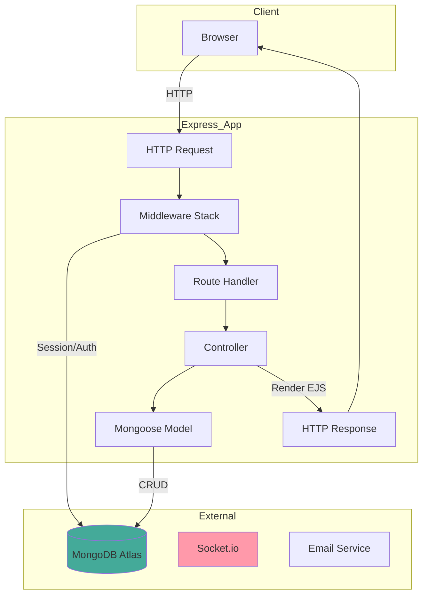
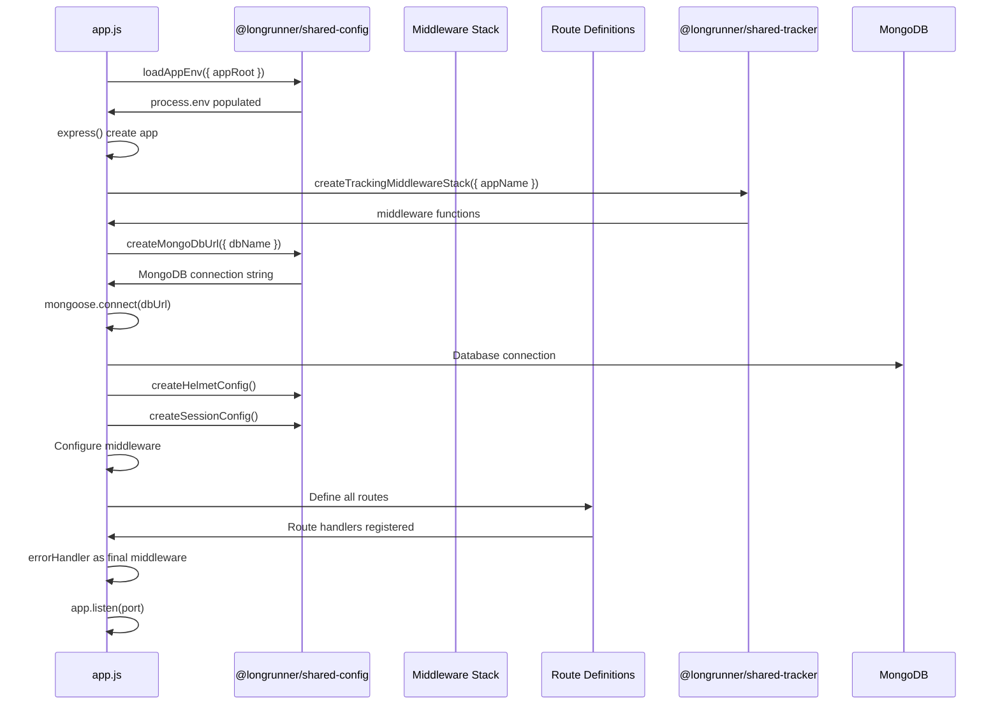
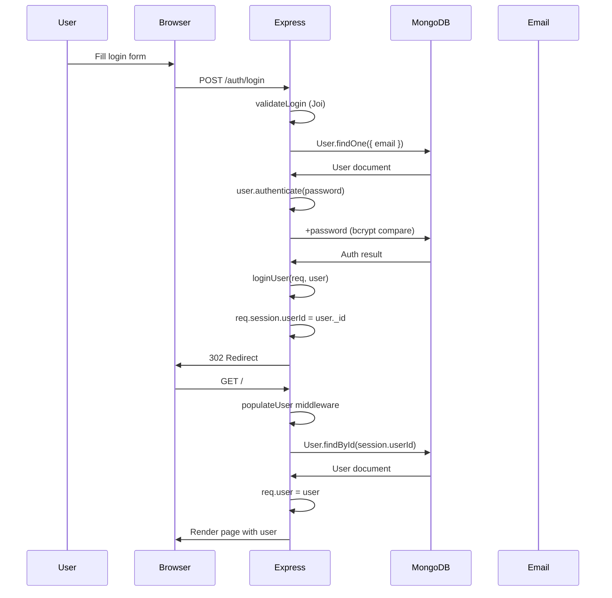
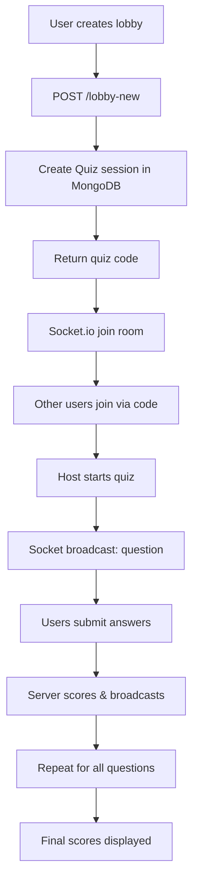

# Architecture Reference - Longrunner Platform

## 1. System Overview

Longrunner Platform is a **multi-app web platform** built as a monorepo using pnpm workspaces. It consists of five Express/EJS web applications and eight shared npm packages that provide reusable functionality.

### Core Characteristics

- **Architecture**: Multi-app Express monorepo (ES modules throughout)
- **Template Engine**: EJS with ejs-mate for layout inheritance (except tracker uses EJS v4)
- **Database**: MongoDB (Atlas) via Mongoose ODM
- **Session Management**: express-session with MongoStore
- **Authentication**: Custom session-based auth with password hashing (bcrypt)
- **Security**: helmet CSP, express-mongo-sanitize, rate limiting, reCAPTCHA
- **Real-time**: Socket.io for quiz multiplayer functionality

### Main Applications

| App       | Port | Purpose                                | Auth Required |
| --------- | ---- | -------------------------------------- | ------------- |
| `landing` | 3000 | Main landing page with policy pages    | No            |
| `blog`    | 3003 | Ironman blog with reviews              | Optional      |
| `slapp`   | 3001 | Shopping list & meal planner           | Yes           |
| `quiz`    | 3002 | Real-time multiplayer quiz (Socket.io) | No            |
| `tracker` | 3004 | Request/IP tracking dashboard          | Yes (admin)   |

### Shared Packages

| Package                         | Purpose                                                           |
| ------------------------------- | ----------------------------------------------------------------- |
| `@longrunner/shared-config`     | Environment config, MongoDB URL builder, session/helmet configs   |
| `@longrunner/shared-utils`      | Error handling, rate limiting, flash messages, catchAsync, mail   |
| `@longrunner/shared-auth`       | User model factory, auth utilities, password handling, auth views |
| `@longrunner/shared-schemas`    | Joi validation schemas (auth, policy)                             |
| `@longrunner/shared-policy`     | Cookie/T&Cs controller factory, policy views                      |
| `@longrunner/shared-ui`         | Boilerplate helper, shared EJS layouts (boilerplate, partials)    |
| `@longrunner/shared-middleware` | Auth/policy middleware factory                                    |
| `@longrunner/shared-tracker`    | Request tracking, IP blocking, geo-IP resolution                  |

---

## 2. Architecture Flow

### Request-Response Cycle



### App Bootstrap Sequence



---

## 3. File/Module Inventory

### Apps

#### `apps/landing/`

| File                        | Purpose                                           | Key Exports                          |
| --------------------------- | ------------------------------------------------- | ------------------------------------ |
| `app.js`                    | Entry point, middleware setup, route registration | Express app instance                 |
| `controllers/policy.js`     | Cookie/T&Cs page handlers                         | `cookiePolicy`, `tandc`, `tandcPost` |
| `controllers/longrunner.js` | Landing page handler                              | `landing`                            |
| `utils/middleware.js`       | T&Cs validation middleware                        | `validateTandC`                      |

#### `apps/blog/`

| File                     | Purpose                                        | Key Exports                          |
| ------------------------ | ---------------------------------------------- | ------------------------------------ |
| `app.js`                 | Entry point, full middleware stack, all routes | Express app                          |
| `controllers/users.js`   | Auth handlers (register, login, reset)         | User auth functions                  |
| `controllers/blogsIM.js` | Blog post CRUD                                 | `index`, `show`                      |
| `controllers/reviews.js` | Review creation/deletion                       | `create`, `deleteReview`             |
| `controllers/admin.js`   | Admin dashboard & moderation                   | `dashboard`, `flaggedReviews`        |
| `models/user.js`         | User model (extends shared-auth)               | Mongoose model                       |
| `models/blogIM.js`       | Blog post schema                               | Mongoose model                       |
| `models/review.js`       | Review schema                                  | Mongoose model                       |
| `utils/middleware.js`    | Auth/validation middleware                     | `isLoggedIn`, `isAdmin`, `validate*` |

#### `apps/slapp/` (Shopping List App)

| File                                                                | Purpose                            |
| ------------------------------------------------------------------- | ---------------------------------- |
| `app.js`                                                            | Entry point with full auth stack   |
| `controllers/meals.js`                                              | Meal CRUD operations               |
| `controllers/ingredients.js`                                        | Ingredient management              |
| `controllers/shoppingLists.js`                                      | Shopping list generation           |
| `controllers/categories.js`                                         | Category customization             |
| `models/meal.js`, `ingredient.js`, `shoppingList.js`, `category.js` | Mongoose schemas                   |
| `utils/middleware.js`                                               | Auth middleware + ownership checks |

#### `apps/quiz/`

| File                              | Purpose                                                                |
| --------------------------------- | ---------------------------------------------------------------------- |
| `app.js`                          | Entry point with Socket.io (uses `server.listen()` not `app.listen()`) |
| `controllers/quiz.js`             | Quiz lobby/game handlers (lobby creation, joining, kicking)            |
| `controllers/api.js`              | AJAX endpoints for quiz state management                               |
| `controllers/policy.js`           | Policy routes (uses shared-policy)                                     |
| `utils/quizChecks.js`             | Quiz state validation middleware                                       |
| `utils/middleware.js`             | Validation middleware (Joi schemas), T&Cs validation                   |
| `models/quiz.js`, `question.js`   | Quiz session schemas                                                   |
| `models/user-session-template.js` | User session state template                                            |
| `public/javascripts/`             | Client-side quiz logic (Socket.io client, AJAX polling)                |

#### `apps/tracker/`

| File                    | Purpose                                                        |
| ----------------------- | -------------------------------------------------------------- |
| `app.js`                | Minimal entry, uses shared-tracker for global tracking         |
| `controllers/admin.js`  | IP tracking dashboard (dashboard, flagged IPs, blocked IPs)    |
| `controllers/policy.js` | Policy routes (uses shared-policy)                             |
| `models/tracker.js`     | Tracker data schema (local, though shared-tracker has its own) |
| `utils/cleaner.js`      | Utility for cleaning/resetting tracker data                    |
| `views/`                | EJS templates for tracker dashboard                            |

### Shared Packages

#### `@longrunner/shared-config/src/index.js`

| Function                                              | Purpose                           |
| ----------------------------------------------------- | --------------------------------- |
| `loadAppEnv({ appRoot })`                             | Load root `.env.shared` variables |
| `createMongoDbUrl({ dbName })`                        | Build Atlas connection string     |
| `createSessionConfig({ name, mongoUrl, MongoStore })` | Session middleware config         |
| `createHelmetConfig()`                                | CSP and security headers          |
| `createCspSources()`                                  | Allowed CDN sources               |

#### `@longrunner/shared-utils/src/`

| File              | Exports                                                                          |
| ----------------- | -------------------------------------------------------------------------------- |
| `catchAsync.js`   | `default: (func) => (req,res,next) => func(req,res,next).catch(next)`            |
| `ExpressError.js` | `class ExpressError extends Error { statusCode }`                                |
| `errorHandler.js` | `errorHandler(err, req, res, next)` - Global error middleware                    |
| `rateLimiter.js`  | `generalLimiter`, `authLimiter`, `passwordResetLimiter`, `formSubmissionLimiter` |
| `flash.js`        | Flash message middleware with sanitization                                       |
| `mail.js`         | Nodemailer wrapper for Zoho SMTP                                                 |

#### `@longrunner/shared-auth/src/`

| File                     | Exports                                                                                 |
| ------------------------ | --------------------------------------------------------------------------------------- |
| `models/user.js`         | `createUserSchema(config)` - User Mongoose schema factory with bcrypt migration support |
| `controllers/users.js`   | `createUsersController(config)` - Auth route handlers factory                           |
| `utils/auth.js`          | `authenticateUser`, `loginUser`, `logoutUser`                                           |
| `utils/passwordUtils.js` | `PasswordUtils` - bcrypt hashing, reset token generation                                |
| `src/views/users/`       | `register.ejs`, `login.ejs`, `forgot.ejs`, `reset.ejs`, `details.ejs`, `deletepre.ejs`  |
| `public/`                | `users.css`, `register.js` (shared auth views assets)                                   |

#### `@longrunner/shared-schemas/src/index.js`

| Export                                                                                          | Purpose                             |
| ----------------------------------------------------------------------------------------------- | ----------------------------------- |
| `Joi`                                                                                           | Extended Joi with `escapeHTML` rule |
| `loginSchema`, `registerSchema`, `forgotSchema`, `resetSchema`, `detailsSchema`, `deleteSchema` | Auth validation schemas             |
| `tandcSchema`                                                                                   | Policy form validation              |
| `createAuthSchemas()`, `createPolicySchemas()`                                                  | Schema factories                    |

#### `@longrunner/shared-tracker/src/`

| File        | Exports                                                                                 |
| ----------- | --------------------------------------------------------------------------------------- |
| `client.js` | `createTrackingMiddlewareStack`, IP normalization, route classification, geo-IP lookup  |
| `store.js`  | `recordRequest`, `blockIpAddress`, `unblockIpAddress`, `getBlockedIps`, `getFlaggedIps` |
| `db.js`     | `getTrackerConnection` - Internal MongoDB connection singleton for tracking data        |

#### `@longrunner/shared-ui/src/`

| File                   | Exports                                                             |
| ---------------------- | ------------------------------------------------------------------- |
| `boilerplateHelper.js` | `boilerplateHelper({ appRoot, meta })` - Res.locals setup for views |
| `index.js`             | Package entry (minimal)                                             |
| `src/views/layouts/`   | `boilerplate.ejs` - Main layout template                            |
| `src/views/partials/`  | `cookieAlert.ejs`, `flash.ejs` - Reusable partials                  |
| `public/`              | CSS/JS assets for shared UI components                              |

#### `@longrunner/shared-policy/src/index.js`

| Export                           | Purpose                                      |
| -------------------------------- | -------------------------------------------- |
| `createPolicyController(config)` | Factory for cookie policy & T&Cs handlers    |
| `src/views/policy/`              | `cookiePolicy.ejs`, `tandc.ejs`, `error.ejs` |
| `public/`                        | CSS/JS assets for policy pages               |

#### `@longrunner/shared-middleware/src/index.js`

| Export                           | Purpose                              |
| -------------------------------- | ------------------------------------ |
| `createPolicyMiddleware(config)` | T&Cs validation middleware factory   |
| `createAuthMiddleware(config)`   | Auth validation + session middleware |

---

## 4. Dependency Map

### Core Dependencies (All Apps)

```
                    ┌─────────────────────────────┐
                    │   @longrunner/shared-config │
                    └──────────────┬──────────────┘
                                   │
           ┌───────────────────────┼───────────────────────┐
           │                       │                       │
           ▼                       ▼                       ▼
┌──────────────────┐   ┌──────────────────┐   ┌──────────────────┐
│ shared-utils     │   │ shared-policy   │   │ shared-ui        │
│ - catchAsync    │   │ - PolicyCtlr    │   │ - boilerplate    │
│ - ExpressError  │   └──────────────────┘   └──────────────────┘
│ - errorHandler  │
│ - rateLimiter   │   ┌──────────────────┐   ┌──────────────────┐
│ - flash         │   │ shared-auth     │   │ shared-tracker  │
│ - mail          │   │ - User schema   │   │ - Tracking      │
└────────┬────────┘   │ - Auth utils    │   └──────────────────┘
         │            └────────┬────────┘
         │                     │
         │            ┌────────┴────────┐
         │            │ shared-schemas  │
         │            │ - Joi validation │
         │            └──────────────────┘
         │
         ▼
┌────────────────────────────────────────────┐
│              Express App                   │
│  (landing, blog, slapp, quiz, tracker)     │
└────────────────────────────────────────────┘
```

### App Entry Points

| App       | Entry    | Shared Packages Imported                                          | Notes                                 |
| --------- | -------- | ----------------------------------------------------------------- | ------------------------------------- |
| `landing` | `app.js` | config, utils, policy, ui, tracker, schemas                       | Basic app, no auth                    |
| `blog`    | `app.js` | + auth, schemas                                                   | Full auth, admin, reviews             |
| `slapp`   | `app.js` | + auth, schemas                                                   | Full auth, meals, shopping lists      |
| `quiz`    | `app.js` | config, utils, policy, ui, tracker, schemas                       | No auth, Socket.io for real-time quiz |
| `tracker` | `app.js` | config, policy, ui, tracker (uses shared-tracker for IP blocking) | Admin dashboard, no shared-auth       |

### External Dependencies (Production)

| Package                  | Purpose                          |
| ------------------------ | -------------------------------- |
| `express`                | Web framework                    |
| `mongoose`               | MongoDB ODM                      |
| `ejs` / `ejs-mate`       | Templating (v5; tracker uses v4) |
| `express-session`        | Session management               |
| `connect-mongo`          | Session store                    |
| `helmet`                 | Security headers                 |
| `express-rate-limit`     | Rate limiting                    |
| `joi`                    | Validation                       |
| `sanitize-html`          | HTML sanitization                |
| `nodemailer`             | Email sending (Zoho SMTP)        |
| `socket.io`              | Real-time (quiz only)            |
| `express-recaptcha`      | reCAPTCHA                        |
| `geoip-lite`             | Geo-IP lookup (tracker)          |
| `axios`                  | HTTP client (quiz only)          |
| `express-mongo-sanitize` | MongoDB injection prevention     |

### No Circular Dependencies

The architecture is strictly layered - shared packages have no imports from apps, and apps only import from shared packages.

---

## 5. Data Flow

### Authentication Flow



### Blog Post Creation Flow

```mermaid
flowchart TD
    A[User POST /admin/posts] --> B[Validate auth & admin]
    B --> C[Validate post data (Joi)]
    C --> D[Create blogIM document]
    D --> E[Save to MongoDB]
    E --> F[Render success flash]
    F --> G[Redirect to post list]
```

### Quiz Real-time Flow



---

## 6. Key Interactions

### Common User Flow: Registration

1. User visits `/auth/register`
2. Renders `users/register.ejs` (from shared-auth views)
3. User submits form → `POST /auth/register`
4. Middleware validates with `validateRegister` (Joi)
5. Rate limited by `authLimiter`
6. Controller creates user via `User.register(user, password)`
7. Password hashed with bcrypt via `PasswordUtils`
8. Session created via `loginUser(req, user)`
9. Confirmation email sent via `mail()`
10. Flash success message, redirect to home

### Common User Flow: Protected Route Access

1. Request to `/meals` (slapp)
2. Middleware chain runs
3. `populateUser` loads user from session
4. `isLoggedIn` checks `req.user`
5. If not logged in → redirect to `/auth/login` with `returnTo`
6. If logged in → controller runs
7. Query MongoDB for user's meals
8. Render EJS with data

### Shopping List Generation Flow (Slapp)

1. User selects meals for the week
2. POST to `/shoppinglist` with meal IDs
3. Server fetches all selected meals with ingredients
4. Ingredients aggregated and matched against user's custom categories
5. Shopping list document created with aggregated ingredients
6. User can edit/customize the list
7. Final list rendered with category grouping

### Quiz Real-time Multiplayer Flow

1. Host creates lobby → POST `/lobby-new`
2. Quiz session created in MongoDB with unique code
3. Other players join via code → POST `/lobby-join`
4. Socket.io room created with quiz code
5. Host starts quiz → `io.to(room).emit('quiz-start')`
6. Questions delivered via Socket events
7. Players submit answers via AJAX
8. Server scores answers, broadcasts results
9. Repeat until all questions answered
10. Final scores broadcast via Socket

### Admin Moderation Flow (Blog)

1. Admin logs in with `role: "admin"`
2. Visits `/admin/flagged-reviews`
3. Sees all flagged reviews
4. POSTs to `/admin/flagged-reviews/:reviewId/:action`
5. Action can be: `keep`, `unflag`, `delete`
6. MongoDB updates review document
7. Flash message confirms action

### IP Blocking/Tracking Flow (Tracker)

1. Each app uses `createTrackingMiddlewareStack({ appName })`
2. Middleware extracts IP, performs geo-IP lookup
3. Checks if IP is blocked (cached, refreshed periodically)
4. On blocked IP → returns 403 response
5. On request completion → `recordRequest()` called
6. Request logged to `TrackerEvent` collection
7. Tracker aggregate updated in `Tracker` collection
8. If bad/good route ratio exceeds threshold → auto-block triggered
9. Email notification sent on auto-block
10. Blocked IPs available in tracker admin dashboard

---

## 7. Extension Points

### Adding a New App

1. **Create directory**: `apps/newapp/`
2. **Create `package.json`**: With name `@longrunner/newapp`
3. **Create entry point**: `app.js` (follow existing pattern)
4. **Set up middleware**: Import from shared packages
5. **Configure views**: Add to `app.set("views", [...])`
6. **Add static assets**: Configure shared package routes
7. **Define routes**: Add controllers in `controllers/`
8. **Create models**: In `models/` directory

### Adding a New Feature to Existing App

| Feature Type   | Files to Modify                                    |
| -------------- | -------------------------------------------------- |
| New route      | `app.js` (register route), new controller file     |
| New model      | `models/*.js`, possibly `app.locals.User`          |
| New validation | Add Joi schema to shared-schemas or app middleware |
| New middleware | `utils/middleware.js`                              |
| New EJS view   | Add to `views/`, update CSS/JS references          |

### Adding Shared Functionality

| Scenario              | Action                                              |
| --------------------- | --------------------------------------------------- |
| New utility           | Add to `shared-utils/src/` and export in `index.js` |
| New validation schema | Add to `shared-schemas/src/index.js`                |
| New UI component      | Add to `shared-ui/src/views/`                       |
| New auth feature      | Modify `shared-auth/` - consider factory pattern    |

### Adding Shared Views

Views from shared packages are mounted by adding the package's views directory to `app.set("views", [...])`. The order matters - earlier directories take precedence:

```javascript
app.set("views", [
  path.join(__dirname, "views"), // App's own views (highest priority)
  path.join(sharedAuthRoot, "src", "views"), // shared-auth views
  path.join(sharedPolicyRoot, "src", "views"), // shared-policy views
  path.join(sharedUiRoot, "src", "views"), // shared-ui views
]);
```

Static assets follow a similar pattern with `app.use()` routes mapping to package `public/` directories.

### Database Schema Changes

1. Modify schema in `models/` (app) or `shared-auth/src/models/user.js`
2. Run migration if needed (manual in Atlas)
3. Test locally with `pnpm --filter <app> exec node app.js`
4. Verify all CRUD operations still work

### Adding New Rate Limiter

1. Edit `shared-utils/src/rateLimiter.js`
2. Export new limiter function
3. Import in app `app.js`
4. Apply to route: `app.get("/path", newLimiter, handler)`

---

## 8. Environment Configuration

### Required Environment Variables

| Variable                           | Used By      | Purpose                             |
| ---------------------------------- | ------------ | ----------------------------------- |
| `MONGODB`                          | All apps     | MongoDB Atlas password              |
| `SESSION_KEY`                      | All apps     | Session secret                      |
| `SITEKEY`                          | All apps     | reCAPTCHA site key                  |
| `SECRETKEY`                        | All apps     | reCAPTCHA secret                    |
| `EMAIL_USER`                       | shared-utils | SMTP username (Zoho)                |
| `ZOHOPW`                           | shared-utils | SMTP password                       |
| `ALIAS_EMAIL`                      | shared-utils | Default send-to address             |
| `IP_WHITE_LIST`                    | tracker      | Comma-separated whitelist of IPs    |
| `TRACKER_BLOCKED_IP_CACHE_TTL_MS`  | tracker      | Cache TTL for blocked IPs           |
| `TRACKER_AUTO_BLOCK_EMAIL_ENABLED` | tracker      | Enable auto-block emails            |
| `TRACKER_AUTO_BLOCK_NOTIFY_TO`     | tracker      | Email for auto-block notifications  |
| `TRACKER_FLAG_THRESHOLD`           | tracker      | Bad route threshold for flagging    |
| `TRACKER_BLOCK_30M_THRESHOLD`      | tracker      | Bad routes to trigger 30-min block  |
| `TRACKER_BLOCK_24H_THRESHOLD`      | tracker      | Bad routes to trigger 24-hour block |
| `TRACKER_EVENT_RETENTION_DAYS`     | tracker      | Days to retain tracker events       |

### Database Names per App

| App       | Database Name       |
| --------- | ------------------- |
| `landing` | `blog`              |
| `blog`    | `blog`              |
| `slapp`   | `slapp`             |
| `quiz`    | `quiz`              |
| `tracker` | `longrunnerTracker` |

### Configuration Files

- `.env.shared` - Shared across all apps (root)
- `.env.shared.example` - Template for new developers

---

## 9. Running the Platform

### Development Commands

```bash
# Install dependencies
pnpm install

# Run individual app
pnpm --filter landing exec node app.js
pnpm --filter slapp exec node app.js
pnpm --filter quiz exec node app.js
pnpm --filter blog exec node app.js
pnpm --filter tracker exec node app.js

# Lint all workspaces
pnpm -r --if-present run lint
```

### Ports

| App     | Port |
| ------- | ---- |
| landing | 3000 |
| slapp   | 3001 |
| quiz    | 3002 |
| blog    | 3003 |
| tracker | 3004 |

### Production Considerations

- All apps listen on `0.0.0.0` to bind to all interfaces (for reverse proxy)
- `trust proxy` enabled in production for correct IP detection behind nginx
- HTTPS termination should be handled by reverse proxy (nginx)
- Session cookies set `secure: true` in production
- reCAPTCHA verification happens server-side via `SECRETKEY`
