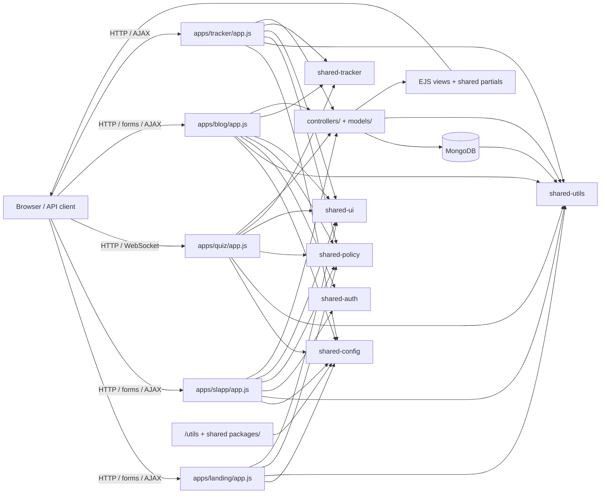
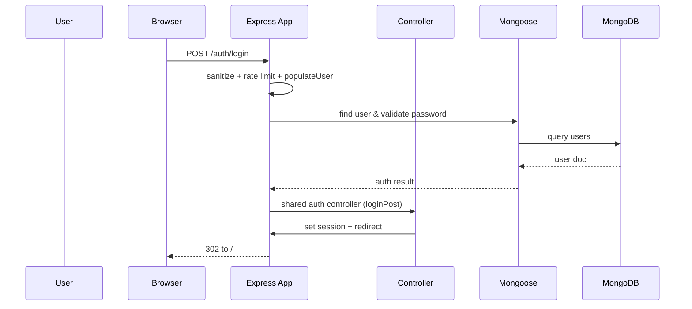
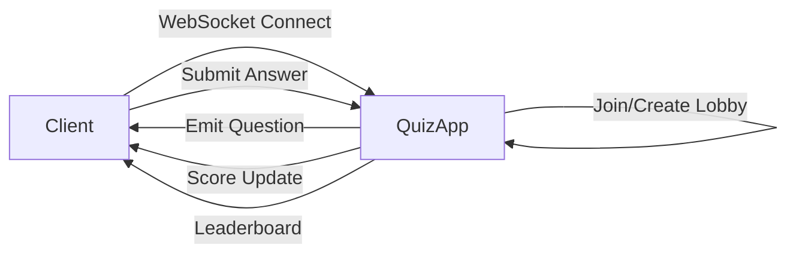

# Architecture Reference - Longrunner Platform

This document provides a birds-eye view of the `longrunner-platform` pnpm workspace, which hosts five Express applications and shared workspace packages. All code runs as ES modules with shared authentication, middleware, schemas, and UI components.

## Table of Contents

1. [System Overview](#system-overview)
2. [Architecture Flow](#architecture-flow)
3. [File/Module Inventory](#filemodule-inventory)
4. [Dependency Map](#dependency-map)
5. [Data Flow](#data-flow)
6. [Key Interactions](#key-interactions)
7. [Extension Points](#extension-points)

---

## System Overview

| App               | Directory      | Port | Focus                                                               |
| ----------------- | -------------- | ---- | ------------------------------------------------------------------- |
| `landing`         | `apps/landing` | 3000 | Landing page linking to other apps, policy pages. No auth/database. |
| `shoppinglist`    | `apps/slapp`   | 3001 | Meal planner, ingredient catalog, weekly shopping list generator.   |
| `longrunner-quiz` | `apps/quiz`    | 3002 | General knowledge quiz with real-time multiplayer via Socket.io.    |
| `ironman-blog`    | `apps/blog`    | 3003 | Ironman training blog, reviews, admin moderation, IP tracking.      |
| `tracker`         | `apps/tracker` | 3004 | Global IP tracking and analytics for longrunner apps.               |

### Shared Workspace Packages

| Package                         | Purpose                                                                                                                     |
| ------------------------------- | --------------------------------------------------------------------------------------------------------------------------- |
| `@longrunner/shared-auth`       | User schema factory, bcrypt password helpers, reusable auth controllers (register/login/forgot/reset).                      |
| `@longrunner/shared-policy`     | Policy/cookie controllers, shared policy views, static assets (`/stylesheets/shared-policy`, `/javascripts/shared-policy`). |
| `@longrunner/shared-middleware` | Validation middleware generators, `isLoggedIn` / `populateUser` helpers powered by shared Joi schemas.                      |
| `@longrunner/shared-schemas`    | Joi schema collection (auth, reviews, meals, ingredients, quiz), includes custom `escapeHTML` string extension.             |
| `@longrunner/shared-config`     | Helpers for building MongoDB URLs, session configs, and Helmet CSP settings.                                                |
| `@longrunner/shared-utils`      | Rate limiters, flash middleware, ExpressError, centralized error handler, mailer, and `catchAsync`.                         |
| `@longrunner/shared-ui`         | Boilerplate helper for meta tags, navbar/footer auto-inclusion, shared EJS partials.                                        |
| `@longrunner/shared-tracker`    | IP tracking middleware with geoip-lite, request recording, IP blocking. Used by blog and quiz apps.                         |

### Core Technologies

- `express@5.x` as the web framework with middleware chains in each `app.js`.
- `mongoose` ODM talking to per-app MongoDB databases (`landing` has no DB, `slapp`, `quiz`, `blog`, `tracker` each have their own).
- `socket.io` for real-time quiz multiplayer (quiz app only).
- `geoip-lite` for IP geolocation in `@longrunner/shared-tracker`.
- `pnpm` workspaces with `"type": "module"` packages.
- `EJS` templating (with `ejs-mate`) and shared EJS partials/views from `shared-auth`, `shared-policy`, and `shared-ui`.
- Authentication via session cookies (MongoStore for persistent sessions) + bcrypt/hash migration.
- Security stack: `helmet` (with CSP from `shared-config`), `express-mongo-sanitize`, `compression`, `express-rate-limit`, `express-recaptcha`, `sanitize-html`.
- Mail delivery via Zoho SMTP configured in `@longrunner/shared-utils/mail.js`.
- Environment variables: `MONGODB`, `SESSION_KEY`, `SITEKEY`, `SECRETKEY`, `EMAIL_USER`, `ALIAS_EMAIL`, `ZOHOPW`.

**Verification:** Run `pnpm --filter <app> lint` after edits. Start apps with `pnpm --filter <app> exec node app.js`.

---

## Architecture Flow

### HTTP request lifecycle (common pattern)



Each `app.js` boots `express`, resolves shared view roots, serves static assets from both local `public/` and shared packages, sanitizes inputs, mounts session/cookie helpers, registers Recaptcha for `/policy/tandc`, wires rate limiters, and then wires routes.

Shared assets are served with explicit prefixes:

- `/stylesheets/shared-policy`, `/javascripts/shared-policy`
- `/stylesheets/shared-auth`, `/javascripts/shared-auth`
- `/javascripts/shared-ui/javascripts`, `/stylesheets/shared-ui/stylesheets`

---

## File/Module Inventory

### `apps/landing` (Port 3000)

- `app.js` – Entry point. Lightweight app with no database. Imports shared policy, utils, and UI. Configures session (in-memory), helmet, compression, rate limiters. Sets multi-root views array for shared policy/UI templates.
- `controllers/`
  - `policy.js` – Cookie policy and T&C with Recaptcha.
  - `longrunner.js` – Landing page render.
- `utils/middleware.js` – `validateTandC` middleware.
- `public/` – Static assets (CSS, JS, favicon, sitemap).

### `apps/slapp` (Port 3001)

- `app.js` – Entry point. Wires shared auth, policy, config, middleware. Connects to `slapp` MongoDB database. Mounts Recaptcha-protected routes and auth controllers.
- `controllers/`
  - `users.js` – Wraps `@longrunner/shared-auth`, seeds setup data (`newUserSeed`) on registration, cleans domain models on delete.
  - `meals.js` – CRUD over `Meal`, handles ingredient lookups, weekly/replace-on-use logic.
  - `ingredients.js` – Ingredient catalog maintenance, cascade deletions from `Meal` docs.
  - `shoppingLists.js` – List generation, editing, default meal assignments, clipboard output.
  - `categories.js` – Category rename with synchronization to ingredients.
- `models/`
  - `User` – Extended from `@longrunner/shared-auth` with `hasResetPasswordUsed`.
  - `Meal` – Complex schema with `weeklyItems`, `replaceOnUse`, `default` flags, meal types.
  - `Ingredient` – Name/category reference to user.
  - `ShoppingList` – Named lists, daily meal slots, `items`, `editVer`.
  - `Category` – Per-user categorical labels.
- `utils/`
  - `middleware.js` – Extends `@longrunner/shared-middleware` with Joi validators for meals, ingredients, shopping lists, categories. Ownership guards (`isAuthorMeal`, etc.).
  - `copyToClip.js` – Formats shopping list items per category.
  - `toUpperCase.js` – Normalizes meal/ingredient names.
  - `newUserSeed.js` – Seeds categories, ingredients, meals for new accounts.
  - `deleteUser.js` – CLI utility for user cleanup.

### `apps/quiz` (Port 3002)

- `app.js` – Entry point. Wires shared config, policy, utils, UI. Connects to `quiz` MongoDB database. **Key difference:** Uses `socket.io` for real-time multiplayer quiz functionality.
- `controllers/`
  - `quiz.js` – Lobby creation/joining, quiz gameplay, user management.
  - `api.js` – AJAX endpoints for quiz state, question fetching, scoring.
  - `policy.js` – Cookie policy and T&C.
- `models/`
  - `quiz.js` – Quiz session state, players, current question index, answers.
  - `question.js` – Question bank with difficulty levels.
  - `schemas.js` – Mongoose schema definitions.
  - `user-session-template.js` – Player data structure.
- `utils/`
  - `middleware.js` – Validators for lobby creation/joining, user data, T&C.
  - `quizChecks.js` – Middleware to validate quiz state.
  - `comments.js` – Utility for comment generation (if used).
- `public/javascripts/` – Client-side Socket.io and quiz logic.

### `apps/blog` (Port 3004)

- `app.js` – Entry point. Wires shared auth, policy, config, middleware. Connects to `blog` MongoDB database.
- `controllers/`
  - `users.js` – Wraps `@longrunner/shared-auth`, handles blog-specific cleanup (removes `Review` docs).
  - `blogsIM.js` – Blog home and detail pages, review population.
  - `reviews.js` – Review CRUD, spam detection (`ContentFilter`), mail notifications for flagged deletions.
  - `admin.js` – Admin dashboards, moderation, flagged review handling, post CRUD.
- `models/`
  - `BlogIM` – Post metadata with `reviews` array.
  - `Review` – Body, author, spam score, IP metadata, flagging status.
  - `User` – Extended from `@longrunner/shared-auth` with role support.
- `utils/`
  - `middleware.js` – Wraps `@longrunner/shared-middleware` with `validateReview`, `isAdmin`, `isReviewAuthor`.
  - `contentFilter.js` – Spam scoring, HTML sanitization, regex-based scoring.
  - `deleteUser.js` – CLI utility for user cleanup.
- `public/` – Static assets.

### `apps/tracker` (Port 3004)

- `app.js` – Entry point. Global IP tracking dashboard for all longrunner apps. Connects to `longrunnerTracker` MongoDB database.
- `controllers/`
  - `admin.js` – Dashboard, tracker analytics, blocked IPs management.
  - `policy.js` – 404 handler.
- `models/`
  - `tracker.js` – IP tracking schema with geo data, route tracking, user agent, TTL index (90 days).
- `utils/`
  - `cleaner.js` – Utility for cleaning up old tracking data.
- `views/admin/` – Dashboard, tracker view, blocked IPs EJS templates.
- `public/` – Static assets (favicon).

### Shared Packages

#### `@longrunner/shared-auth`

- `createUserSchema()` – Builds shared `User` schema with optional role/resetPasswordUsed flags, includes Passport hash migration.
- `createUsersController()` – Handles registration/login/logout/forgot/reset/details/delete, flashes, protects default users.
- `./auth.js`, `./passwordUtils.js`, `./user.js`, `./controllers.js` – Aliased exports.

#### `@longrunner/shared-policy`

- `createPolicyController()` – Renders cookie policy and T&C, wires Recaptcha for `/policy/tandc`, sends contact submission emails.
- `src/views/policy/*` – Shared policy EJS templates.
- `public/` – Shared policy CSS/JS assets.

#### `@longrunner/shared-middleware`

- `createAuthMiddleware()` – Builds Joi-based validators plus `isLoggedIn`/`populateUser`.

#### `@longrunner/shared-schemas`

- `Joi` extension with `escapeHTML`.
- Exported schema bundles: `createAuthSchemas`, `createBlogSchemas`, `createSlappSchemas`, `createQuizSchemas`.

#### `@longrunner/shared-config`

- `createMongoDbUrl({ dbName })` – Centralizes MongoDB connection strings.
- `createSessionConfig({ name, mongoUrl, MongoStore })` – Session cookies with MongoStore.
- `createHelmetConfig()` – CSP builder for production/development.
- `createCspSources()` – CSP helper.
- `loadAppEnv({ appRoot })` – Loads environment variables from app's `.env`.

#### `@longrunner/shared-utils`

- `catchAsync` – Wraps async handlers.
- `mail` – Nodemailer mailer using Zoho SMTP.
- `ExpressError`, `errorHandler` – Standard error class and middleware.
- `flash` – Session-based flash helper.
- Rate limiters: `generalLimiter`, `authLimiter`, `passwordResetLimiter`, `formSubmissionLimiter`.

#### `@longrunner/shared-ui`

- `boilerplateHelper({ appRoot, meta, misc })` – Middleware that auto-includes navbar/footer, sets meta tags, injects CSS/JS paths.

#### `@longrunner/shared-tracker`

- `normalizeIp(req)` – Extracts and normalizes IP from request headers (handles X-Forwarded-For, proxy IPs).
- `createIpContextMiddleware()` – Attaches geoip-lite data to `req.ipInfo` (country, city, region, timezone).
- `createTrackRequestMiddleware({ appName, skipPaths })` – Records requests to MongoDB with route, status, user agent.
- `createBlockedIpMiddleware({ cacheTtlMs })` – Blocks IPs listed in tracker DB, with cached lookup.
- `createTrackingMiddlewareStack({ appName })` – Combines all three middlewares into a stack.
- `getBlockedIps()`, `recordRequest()`, `blockIpAddress()`, `unblockIpAddress()` – Database operations.

---

## Dependency Map

### Core dependencies (workspace-wide)

- `express`, `mongoose`, `express-session`, `connect-mongo`, `express-mongo-sanitize`, `helmet`, `compression`, `method-override`, `express-back`, `ejs-mate`, `express-rate-limit`, `express-recaptcha`, `socket.io`.
- `dotenv/config` for environment variables, `sanitize-html`, `nodemailer`, `geoip-lite`.

### Graph view (entry points and imports)

```mermaid
graph TD
    LandingApp["apps/landing/app.js"] --> SharedConfig["shared-config"]
    LandingApp --> SharedPolicy["shared-policy"]
    LandingApp --> SharedUtils["shared-utils"]
    LandingApp --> SharedUi["shared-ui"]

    SlappApp["apps/slapp/app.js"] --> SharedConfig
    SlappApp --> SharedAuth["shared-auth"]
    SlappApp --> SharedPolicy
    SlappApp --> SharedUtils
    SlappApp --> SharedMiddleware["shared-middleware"]
    SlappApp --> SharedUi

    QuizApp["apps/quiz/app.js"] --> SharedConfig
    QuizApp --> SharedPolicy
    QuizApp --> SharedUtils
    QuizApp --> SharedUi
    QuizApp --> SharedMiddleware

    BlogApp["apps/blog/app.js"] --> SharedConfig
    BlogApp --> SharedAuth
    BlogApp --> SharedPolicy
    BlogApp --> SharedUtils
    BlogApp --> SharedMiddleware
    BlogApp --> SharedUi
    BlogApp --> SharedTracker["shared-tracker"]

    TrackerApp["apps/tracker/app.js"] --> SharedConfig
    TrackerApp --> SharedPolicy
    TrackerApp --> SharedTracker
    TrackerApp --> SharedUi
    TrackerApp --> SharedUtils

    SlappApp --> SlappControllers[controllers/*.js]
    QuizApp --> QuizControllers
    BlogApp --> BlogControllers
    TrackerApp --> TrackerControllers[controllers/*.js]

    SlappControllers --> SlappModels[models/*.js]
    QuizControllers --> QuizModels
    BlogControllers --> BlogModels
    TrackerControllers --> TrackerModels[models/*.js"]

    SlappControllers --> SharedUtils
    QuizControllers --> SharedUtils
    BlogControllers --> SharedUtils

    SharedMiddleware --> SharedSchemas["shared-schemas"]
    SharedAuth --> SharedUtils
    SharedPolicy --> SharedUtils
```

### Entry Points

| App       | Entry Point                       |
| --------- | --------------------------------- |
| `landing` | `apps/landing/app.js` (port 3000) |
| `slapp`   | `apps/slapp/app.js` (port 3001)   |
| `quiz`    | `apps/quiz/app.js` (port 3002)    |
| `blog`    | `apps/blog/app.js` (port 3003)    |
| `tracker` | `apps/tracker/app.js` (port 3004) |
| `blog`    | `apps/blog/app.js` (port 3004)    |

### Circular dependencies

None detected. Shared packages are unidirectional utilities consumed by apps. Controllers import models and shared utilities without mutual dependencies.

---

## Data Flow

### General request-response loop

1. Browser issues GET/POST to any app's route (`/auth/*`, `/policy/*`, `/meals`, `/quiz`, `/blogim`, etc.).
2. `app.js` sanitizes `req.body`/`req.params`, sets trust proxy in production, attaches flash/session middleware, sets `res.locals.currentUser`, enforces rate limits.
3. Request enters route-specific validator (from `@longrunner/shared-middleware` or app's `utils/middleware.js`).
4. If valid, controller executes business logic:
   - Reads/writes Mongoose models
   - Possibly populates references
   - Uses shared mailer/rate limiters
   - Renders EJS view (with shared policy/auth/UI partials) or redirects.
5. MongoDB responds via Mongoose; results get formatted and sent back.



### Quiz real-time flow (Socket.io)



### Shopping list creation flow

1. Authenticated user posts `/shoppinglist` with meal IDs; `validateshoppingListMeals` confirms payload.
2. Controller `shoppingLists.createMeals` loads `Meal` docs (including weekly/replace-on-use), aggregates ingredient quantities by category, merges constant/non-food meals, saves `ShoppingList` with `editVer`.
3. Redirects to `/shoppinglist/edit/:id` where `copyListFunc` formats for clipboard/print.

### Blog review creation flow

1. Visitor posts to `/blogim/:id/reviews`.
2. `validateReview` and `ContentFilter` check for spam.
3. Review saved with metadata (IP, spam score).
4. If flagged, admin notified via mailer.
5. Review ID pushed to `BlogIM.reviews` array.

### IP tracking flow

1. Request hits any app with `@longrunner/shared-tracker` middleware enabled (blog, quiz).
2. `createIpContextMiddleware` extracts IP from headers/proxy, uses `geoip-lite` to add geo data to `req.ipInfo`.
3. `createBlockedIpMiddleware` checks cached blocklist; returns 403 if IP is blocked.
4. `createTrackRequestMiddleware` records request on response `finish` event to `longrunnerTracker` database.
5. Tracker app at `/admin/tracker` provides dashboard to view aggregated stats and manage blocked IPs.

---

## Key Interactions

### 1. User registration (slapp, blog)

1. `GET /auth/register` renders shared form (`@longrunner/shared-auth`).
2. `POST /auth/register` runs `validateRegister`, `authLimiter`, then `users.registerPost`.
3. Handler hashes password (`PasswordUtils`), saves user, seeds domain data (`newUserSeed` for slapp), logs user in, flashes success.

### 2. Password reset (slapp, blog)

1. `POST /auth/forgot` validates email, generates token, sets expires fields, mails reset link.
2. `GET /auth/reset/:token` validates token, renders reset view.
3. `POST /auth/reset/:token` hashes new password, marks `resetPasswordUsed`, clears legacy hashes, logs user in, emails confirmation.

### 3. Quiz multiplayer session

1. User creates lobby (`POST /lobby-new`) or joins (`POST /lobby-join`).
2. Socket.io room created/joined with quiz code.
3. Host starts quiz (`/api/start-quiz`), questions delivered via WebSocket.
4. Players submit answers, scores updated in real-time.
5. Quiz ends (`/api/finished-quiz`), leaderboard displayed.

### 4. Blog review moderation

1. Visitor posts review at `/blogim/:id/reviews`.
2. `ContentFilter` scores for spam, stores metadata.
3. Flagged reviews notify admins via shared mailer.
4. Admins approve/delete via `admin.flaggedReviews`.

### 5. Shopping list generation

1. Authenticated user posts `/shoppinglist` with meal IDs.
2. Controller aggregates quantities, saves `ShoppingList`, limits to ten per user.
3. Redirects to edit view with `copyListFunc` formatting.

### 6. Policy/contact form (all apps)

1. `/policy/tandc` renders Recaptcha-protected form.
2. Submissions go through rate limiting, validation, and `shared-policy.tandcPost`.
3. Notifies both submitter and owner via shared mailer.

### 7. IP tracking and blocking

1. Blog and quiz apps use `@longrunner/shared-tracker` middleware to record requests.
2. Tracker app (`/admin/tracker`) displays aggregated IP stats by app, country, route.
3. Admin can block IPs at `/admin/blocked-ips`; blocked IPs get 403 on other apps.
4. Tracking data auto-expires after 90 days via MongoDB TTL index.

---

## Extension Points

1. **New domain feature** – Add `models/<feature>.js`, export Mongoose schema, wire to new or existing controller.
2. **New app** – Create under `apps/<name>/`, copy existing `app.js` structure, add to workspace in `package.json`.
3. **New shared utility** – Add to appropriate `@longrunner/shared-*` package, export, import in apps.
4. **New quiz question category** – Add to `apps/quiz/models/question.js` schema, update difficulty enums.
5. **New validation schema** – Add to `@longrunner/shared-schemas`, consume in app middleware.
6. **Enable IP tracking** – Add `@longrunner/shared-tracker` middleware to app's `app.js` and configure with app name.

### Files typically modified for new features

| Feature Type       | Files to Modify                                                            |
| ------------------ | -------------------------------------------------------------------------- |
| New route          | `app.js` (mount), `controllers/*.js`, `models/*.js`, `utils/middleware.js` |
| New shared utility | New file in `packages/shared-*/src/`, export from package index            |
| New validation     | `packages/shared-schemas/src/*.js`, `apps/*/utils/middleware.js`           |
| New quiz type      | `apps/quiz/models/question.js`, `apps/quiz/controllers/api.js`             |
| Admin feature      | `apps/blog/controllers/admin.js`, relevant model                           |
| IP tracking        | `app.js` (add middleware), `apps/tracker/views/admin/*.ejs` (if new views) |

---

## Verification Commands

```bash
# Lint a single workspace
pnpm --filter landing lint
pnpm --filter shoppinglist lint
pnpm --filter longrunner-quiz lint
pnpm --filter ironman-blog lint
pnpm --filter tracker lint

# Boot an app
pnpm --filter landing exec node app.js
pnpm --filter shoppinglist exec node app.js
pnpm --filter longrunner-quiz exec node app.js
pnpm --filter ironman-blog exec node app.js
pnpm --filter tracker exec node app.js
```

---

_Last Updated: 2026-03-14_
