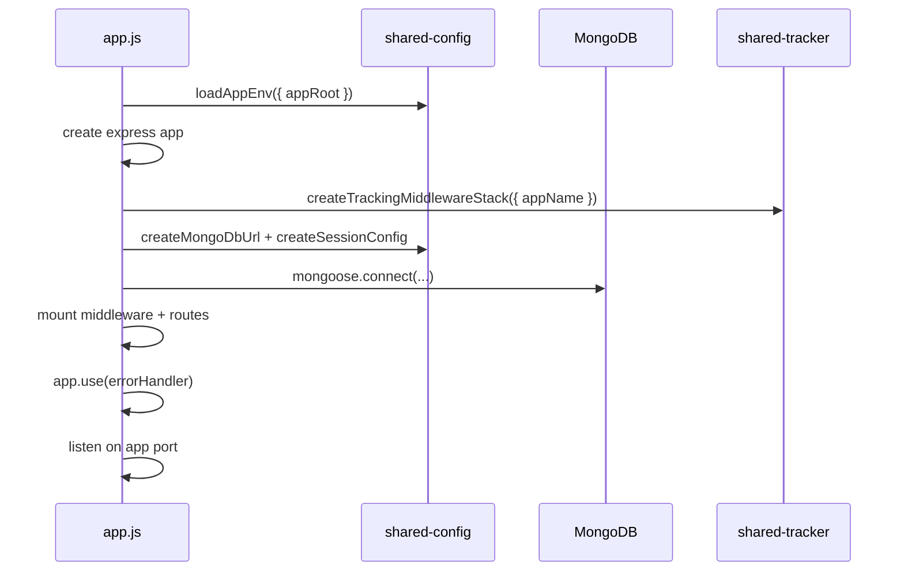
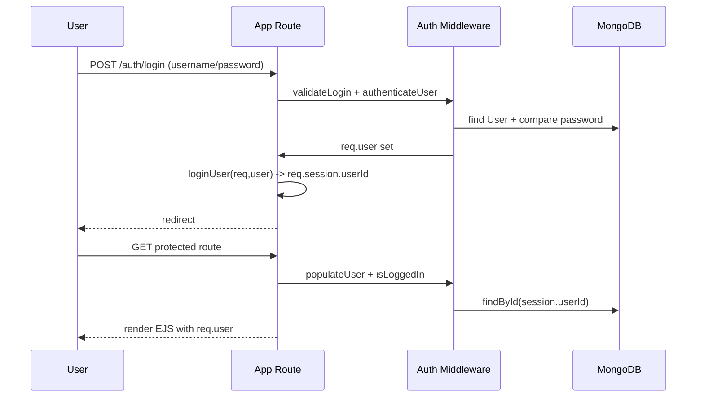

# Architecture Reference - Longrunner Platform

This document is generated from the current monorepo structure (`apps/*`, `packages/shared-*`) and code-level imports/exports.

## 1. System Overview

Longrunner Platform is a pnpm workspace monorepo containing five Express 5 applications and eight shared workspace packages.

### What the platform does

- Runs multiple user-facing web apps under one repository: landing, shopping list planner, multiplayer quiz, blog, and tracker dashboard.
- Shares cross-cutting behavior (env/config, auth factories, policy pages, Joi schemas, tracking middleware, UI boilerplate, utilities) through reusable packages.
- Uses a single MongoDB database (`longrunner-platform` by default) with app-prefixed collections for data isolation.

### Runtime model

- **Server stack**: Express + EJS/ejs-mate, ES modules throughout.
- **Persistence**: MongoDB Atlas with Mongoose models.
- **Session/auth**: `express-session` + `connect-mongo`, custom session auth in `@longrunner/shared-auth`.
- **Security controls**: helmet CSP, mongo-sanitize, Joi validation, rate limiting, reCAPTCHA.
- **Real-time layer**: Socket.io in `apps/quiz` only.
- **Cross-app request analytics**: `@longrunner/shared-tracker` middleware stack in landing/slapp/quiz/blog.

### Applications

| App | Port | Primary responsibility | Auth model |
| --- | --- | --- | --- |
| `apps/landing` | 3000 | Navigation hub and policy/contact pages | Public |
| `apps/slapp` | 3001 | Meal, ingredient, category, shopping-list workflows | Session auth required for core flows |
| `apps/quiz` | 3002 | Trivia lobby + multiplayer quiz orchestration | Session-based quiz state (not account auth) |
| `apps/blog` | 3003 | Blog posts, reviews, admin moderation | Session auth + role checks for admin routes |
| `apps/tracker` | 3004 | Tracker analytics and IP block management UI | No shared-auth middleware; access controls are operational/deployment-level |

### Shared packages

| Package | Responsibility |
| --- | --- |
| `@longrunner/shared-config` | `.env.shared` loading, Mongo URL builder, session config, Helmet config, ESLint config factory |
| `@longrunner/shared-utils` | `catchAsync`, flash middleware, global error handler, mail wrapper, rate limiters |
| `@longrunner/shared-auth` | User schema factory, users controller factory, auth/session helper utilities, password utilities |
| `@longrunner/shared-schemas` | Shared Joi extension (`escapeHTML`) + auth/policy schemas |
| `@longrunner/shared-policy` | Policy controller factory (`cookiePolicy`, `tandc`, `tandcPost`) |
| `@longrunner/shared-middleware` | Auth/policy middleware factories using shared schemas |
| `@longrunner/shared-ui` | `boilerplateHelper` for common locals/meta/includes and shared partial/layout assets |
| `@longrunner/shared-tracker` | IP normalization, blocked-IP middleware, request tracking, auto-block logic, summary reporting |

---

## 2. Architecture Flow

### End-to-end request flow

```mermaid
flowchart LR
  C[Browser] --> A1[App Entry: apps/*/app.js]
  A1 --> M1[Tracking + Security + Session Middleware]
  M1 --> R[Route Handlers]
  R --> CT[Controllers]
  CT --> MD[Mongoose Models]
  MD --> DB[(MongoDB Atlas)]
  CT --> V[EJS Render or JSON]
  V --> C

  CT --> U[@longrunner/shared-utils]
  M1 --> CFG[@longrunner/shared-config]
  M1 --> MW[@longrunner/shared-middleware]
  CT --> POL[@longrunner/shared-policy]
```

### Bootstrap sequence per app

```mermaid
sequenceDiagram
  participant app as app.js
  participant cfg as shared-config
  participant db as MongoDB
  participant tr as shared-tracker

  app->>cfg: loadAppEnv({ appRoot })
  app->>app: create express app
  app->>tr: createTrackingMiddlewareStack({ appName })
  app->>cfg: createMongoDbUrl + createSessionConfig
  app->>db: mongoose.connect(...)
  app->>app: mount middleware + routes
  app->>app: app.use(errorHandler)
  app->>app: listen on app port
```

### Quiz real-time control flow

```mermaid
flowchart TD
  Host[Host creates lobby] --> L1[POST /lobby-new]
  L1 --> Q1[Persist Quiz + Questions]
  Q1 --> Lobby[/lobby rendered]
  Joiner[Player joins] --> L2[POST /lobby-join]
  L2 --> Lobby
  Lobby --> S1[Socket event: start]
  S1 --> QuizPage[/quiz]
  QuizPage --> A1[POST /api/submit-quiz]
  A1 --> S2[Socket event: submit]
  S2 --> A2[GET /api/show-quiz]
  A2 --> A3[GET /api/next-quiz or /api/finished-quiz]
  A3 --> Finish[/finish]
```

---

## 3. File/Module Inventory

### Repository-level

| Path | Purpose | Key exports/entrypoints |
| --- | --- | --- |
| `package.json` | Workspace root, scripts, engine/pnpm pinning | `dev`, `start` scripts |
| `pnpm-workspace.yaml` | Workspace membership | n/a |
| `Dockerfile` | Containerized runtime build | n/a |
| `docs/` | Internal docs including this file | n/a |

### Applications (`apps/*`)

#### `apps/landing`

| File | Purpose | Main exports/functions |
| --- | --- | --- |
| `apps/landing/app.js` | Entry point, shared middleware mounting, policy + landing routes | process entrypoint |
| `apps/landing/controllers/longrunner.js` | Landing page renderer | `landing` |
| `apps/landing/controllers/policy.js` | App-specific policy controller instance + 404 handler | `cookiePolicy`, `tandc`, `tandcPost`, `notFound` |
| `apps/landing/utils/middleware.js` | Policy form validation middleware factory wiring | `validateTandC` |

#### `apps/slapp`

| File | Purpose | Main exports/functions |
| --- | --- | --- |
| `apps/slapp/app.js` | Main routing, auth wiring, meals/ingredients/shopping/category flows | process entrypoint |
| `apps/slapp/controllers/users.js` | Shared-auth controller instance + slapp register/delete hooks | `register*`, `login*`, `forgot*`, `reset*`, `details*`, `delete*` |
| `apps/slapp/controllers/meals.js` | Meal CRUD + recipe ingredient composition | `index`, `newMeal`, `create`, `show`, `edit`, `update`, `deleteMeal` |
| `apps/slapp/controllers/ingredients.js` | Ingredient list/edit/delete with meal reference cleanup | `index`, `edit`, `update`, `deleteIngredient` |
| `apps/slapp/controllers/shoppingLists.js` | Shopping list generation/edit/show/default meal assignment | `landing`, `index`, `newMeals`, `createMeals`, `edit`, `createIngredients`, `show`, `deleteShoppingList`, `defaultGet`, `defaultPatch` |
| `apps/slapp/controllers/categories.js` | User category customization + ingredient category remap | `indexCustomise`, `updateCustomise` |
| `apps/slapp/controllers/policy.js` | Policy controller instance + 404 | `cookiePolicy`, `tandc`, `tandcPost`, `notFound` |
| `apps/slapp/utils/middleware.js` | Auth middleware wiring, Joi validators, ownership checks | `validate*`, `isLoggedIn`, `populateUser`, `isAuthor*` |
| `apps/slapp/models/user.js` | User model from shared-auth factory | default `User` |
| `apps/slapp/models/meal.js` | Meal schema (weekly/replace lists, defaults) | `Meal`, `mealType`, `defaults` |
| `apps/slapp/models/ingredient.js` | Ingredient schema | `Ingredient` |
| `apps/slapp/models/shoppingList.js` | Weekly meal plan + computed items schema | `ShoppingList` |
| `apps/slapp/models/category.js` | User category list schema | `Category` |
| `apps/slapp/models/schemas.js` | Slapp Joi payload schemas | `mealSchema`, `ingredientSchema`, `defaultSchema`, `shoppingListMealsSchema`, `categorySchema`, `shoppingListIngredientsSchema` |
| `apps/slapp/utils/newUserSeed.js` | Seeds new user with default categories/ingredients/meals | `newUserSeed` |
| `apps/slapp/utils/copyToClip.js` | Formats shopping list text for clipboard | `copyListFunc` |
| `apps/slapp/utils/toUpperCase.js` | Capitalization helper | `toUpperCase` |

#### `apps/quiz`

| File | Purpose | Main exports/functions |
| --- | --- | --- |
| `apps/quiz/app.js` | Express + Socket.io setup, quiz/api routes, quiz-state middleware | process entrypoint |
| `apps/quiz/controllers/quiz.js` | Lobby lifecycle, quiz progression, kick/reset controls | `index`, `lobbyNewPost`, `lobbyJoinPost`, `lobby`, `quiz`, `finish`, `quizKickUserPatch`, `resetUserPatch`, `resetQuizDelete` |
| `apps/quiz/controllers/api.js` | AJAX endpoints to transition quiz state | `quizCode`, `startQuiz`, `submitQuiz`, `showQuiz`, `nextQuiz`, `finishedQuiz` |
| `apps/quiz/controllers/policy.js` | Policy controller instance + 404 | `cookiePolicy`, `tandc`, `tandcPost`, `notFound` |
| `apps/quiz/utils/middleware.js` | Joi validation for lobby/user session data + policy validation | `validateTandC`, `validateLobbyNew`, `validateLobbyJoin`, `validateUserData` |
| `apps/quiz/utils/quizChecks.js` | Route gating and session/db quiz-state reconciliation | `quizChecks` |
| `apps/quiz/utils/comments.js` | Score-to-comment mapper | default `getComment` |
| `apps/quiz/models/quiz.js` | Quiz session aggregate model | default `Quiz` |
| `apps/quiz/models/question.js` | Question model fetched from Trivia API responses | default `Question` |
| `apps/quiz/models/schemas.js` | Joi schemas for lobby and `userData` session structure | `lobbyNewSchema`, `lobbyJoinSchema`, `userDataSchema` |
| `apps/quiz/public/javascripts/socket.js` | Client socket listeners (`resetQuiz`, reconnect) | browser script |
| `apps/quiz/public/javascripts/lobby.js` | Lobby page start/join realtime behavior | browser script |
| `apps/quiz/public/javascripts/quiz.js` | Answer submission + timers + socket-driven transitions | browser script |

#### `apps/blog`

| File | Purpose | Main exports/functions |
| --- | --- | --- |
| `apps/blog/app.js` | Entrypoint for auth, public posts, reviews, admin routes | process entrypoint |
| `apps/blog/controllers/users.js` | Shared-auth controller instance + review cleanup hook on delete | `register*`, `login*`, `forgot*`, `reset*`, `details*`, `delete*` |
| `apps/blog/controllers/blogsIM.js` | Blog list/detail pages | `index`, `show` |
| `apps/blog/controllers/reviews.js` | Review create/delete and spam-flag workflow | `create`, `deleteReview`, `reviewLogin` |
| `apps/blog/controllers/admin.js` | Admin dashboard/posts/review moderation workflows | `dashboard`, `posts`, `newPost`, `createPost`, `editPost`, `updatePost`, `deletePost`, `flaggedReviews`, `updateFlaggedReview`, `allReviews`, `deleteReviewWithReason` |
| `apps/blog/controllers/policy.js` | Policy controller instance + 404 | `cookiePolicy`, `tandc`, `tandcPost`, `notFound` |
| `apps/blog/utils/middleware.js` | Auth/policy middleware wiring, review validation, role checks | `validate*`, `isLoggedIn`, `populateUser`, `validateReview`, `isAdmin`, `isReviewAuthor` |
| `apps/blog/utils/contentFilter.js` | Heuristic spam scoring and sanitization logic | default `ContentFilter` |
| `apps/blog/models/user.js` | User model with role support | default `User` |
| `apps/blog/models/blogIM.js` | Blog post model | default `BlogIM` |
| `apps/blog/models/review.js` | Review model including moderation metadata | default `Review` |
| `apps/blog/models/schemas.js` | Joi schema for review payload | `reviewSchema` |

#### `apps/tracker`

| File | Purpose | Main exports/functions |
| --- | --- | --- |
| `apps/tracker/app.js` | Tracker dashboard app, summary email scheduler, admin routes | process entrypoint |
| `apps/tracker/controllers/admin.js` | Aggregations for dashboard/tracker/summary + block/unblock handlers | `dashboard`, `tracker`, `blockedIPs`, `flaggedIPs`, `summary`, `blockIP`, `unblockIP` |
| `apps/tracker/controllers/policy.js` | 404 handler | `notFound` |
| `apps/tracker/models/tracker.js` | Local model mirror for tracker aggregates collection | default `Tracker` |
| `apps/tracker/utils/cleaner.js` | Standalone cleanup utility for old tracker records | `cleanupOldRecords` |
| `apps/tracker/utils/cleanIpBadRoutes.js` | CLI utility to preview/apply bad-route cleanup for an IP | `cleanIpBadRoutes` |
| `apps/tracker/utils/migrateUnifiedDatabase.js` | Legacy-db to unified-db migration utility | `migrateUnifiedDatabase` |

### Shared packages (`packages/shared-*`)

| File | Purpose | Main exports/functions |
| --- | --- | --- |
| `packages/shared-config/src/index.js` | Env/session/helmet/db helpers | `loadAppEnv`, `createMongoDbUrl`, `createSessionConfig`, `createCspSources`, `createHelmetConfig`, `createAppEslintConfig` |
| `packages/shared-config/src/eslint.js` | Reusable ESLint config factory | `createAppEslintConfig` |
| `packages/shared-utils/src/catchAsync.js` | Async wrapper for express handlers | default function |
| `packages/shared-utils/src/flash.js` | Session-backed flash with sanitize-html | default middleware factory |
| `packages/shared-utils/src/errorHandler.js` | Global render-based error handling | `errorHandler` |
| `packages/shared-utils/src/rateLimiter.js` | General/auth/reset/form rate limiter instances | `generalLimiter`, `authLimiter`, `passwordResetLimiter`, `formSubmissionLimiter` |
| `packages/shared-utils/src/mail.js` | Zoho SMTP mail sender | default `mail` |
| `packages/shared-auth/src/models/user.js` | Factory for user schema with legacy passport-hash migration path | `createUserSchema` |
| `packages/shared-auth/src/controllers/users.js` | Factory for register/login/reset/details/delete route handlers | `createUsersController` |
| `packages/shared-auth/src/utils/auth.js` | Session login/logout/auth middleware | `authenticateUser`, `loginUser`, `logoutUser` |
| `packages/shared-auth/src/utils/passwordUtils.js` | bcrypt + reset token utilities | `PasswordUtils` |
| `packages/shared-policy/src/index.js` | Policy controller factory and contact-form mail logic | `createPolicyController` |
| `packages/shared-schemas/src/index.js` | Shared Joi extension + auth/policy schema factories | `Joi`, `createPolicySchemas`, `createAuthSchemas` |
| `packages/shared-middleware/src/index.js` | Policy/auth middleware factories and validators | `createPolicyMiddleware`, `createAuthMiddleware` |
| `packages/shared-ui/src/boilerplateHelper.js` | Injects layout includes/meta defaults into `res.render` | `boilerplateHelper` |
| `packages/shared-tracker/src/client.js` | Tracking middleware factories (IP context, blocked IP guard, request recording) | `createTrackingMiddlewareStack` and related helpers |
| `packages/shared-tracker/src/store.js` | Tracker event persistence, auto-block engine, summaries, block APIs | `recordRequest`, `getBlockedIps`, `getFlaggedIps`, `blockIpAddress`, `unblockIpAddress`, `getTrackerSummary`, `sendWeeklySummaryEmailIfDue`, etc. |
| `packages/shared-tracker/src/db.js` | Tracker connection singleton helper | `getTrackerConnection` |

---

## 4. Dependency Map

### High-level package dependency graph

```mermaid
graph TD
  SC[@longrunner/shared-config]
  SU[@longrunner/shared-utils]
  SA[@longrunner/shared-auth]
  SM[@longrunner/shared-middleware]
  SP[@longrunner/shared-policy]
  SS[@longrunner/shared-schemas]
  ST[@longrunner/shared-tracker]
  SUI[@longrunner/shared-ui]

  SA --> SU
  SM --> SU
  SP --> SU
  ST --> SC
  ST --> SU

  L[apps/landing/app.js] --> SC
  L --> SU
  L --> SM
  L --> SP
  L --> SS
  L --> ST
  L --> SUI

  B[apps/blog/app.js] --> SC
  B --> SU
  B --> SA
  B --> SM
  B --> SP
  B --> SS
  B --> ST
  B --> SUI

  S[apps/slapp/app.js] --> SC
  S --> SU
  S --> SA
  S --> SM
  S --> SP
  S --> SS
  S --> ST
  S --> SUI

  Q[apps/quiz/app.js] --> SC
  Q --> SU
  Q --> SM
  Q --> SP
  Q --> SS
  Q --> ST
  Q --> SUI

  T[apps/tracker/app.js] --> SC
  T --> SU
  T --> SP
  T --> ST
  T --> SUI
```

### Entry points

- Application entry points: `apps/landing/app.js`, `apps/slapp/app.js`, `apps/quiz/app.js`, `apps/blog/app.js`, `apps/tracker/app.js`.
- Shared package entry points: `packages/shared-*/src/index.js` via package `exports` fields.

### Core internal import chains

- **Auth chain**: app auth routes -> `apps/*/controllers/users.js` -> `@longrunner/shared-auth/controllers.js` -> `@longrunner/shared-auth/utils/auth.js` and app `models/user.js` (`createUserSchema`).
- **Validation chain**: app middleware -> `@longrunner/shared-middleware` + `@longrunner/shared-schemas` + app-local schema modules (`apps/slapp/models/schemas.js`, `apps/quiz/models/schemas.js`, `apps/blog/models/schemas.js`).
- **Tracking chain**: app bootstrap -> `createTrackingMiddlewareStack` -> `client.js` middleware -> `recordRequest` in `store.js` -> tracker collections.

### Circular dependency status

- Local JS import graph scan across `apps/` and `packages/` reports **0 circular dependencies**.

---

## 5. Data Flow

### A. Session-authenticated request (blog/slapp)

```mermaid
sequenceDiagram
  participant U as User
  participant A as App Route
  participant M as Auth Middleware
  participant DB as MongoDB

  U->>A: POST /auth/login (username/password)
  A->>M: validateLogin + authenticateUser
  M->>DB: find User + compare password
  M->>A: req.user set
  A->>A: loginUser(req,user) -> req.session.userId
  A-->>U: redirect
  U->>A: GET protected route
  A->>M: populateUser + isLoggedIn
  M->>DB: findById(session.userId)
  A-->>U: render EJS with req.user
```

### B. Tracker data lifecycle

1. App-level middleware stack creates `req.ipInfo` (`normalizeIp`, geo lookup).
2. Blocked-IP middleware checks cached blocked IPs (`getBlockedIps`) and can short-circuit with `403`.
3. On `res.finish`, tracking middleware calls `recordRequest(trackerData)`.
4. `recordRequest` writes event row (`tracker_events`) and updates aggregate row (`tracker_trackers`).
5. For bad routes, ratio/threshold logic can auto-promote block levels (`30m` -> `24h` -> `permanent`) into `tracker_ipblocks` + block history collections.
6. Tracker admin pages read summaries (`getFlaggedIps`, `getTrackerSummary`, `getActiveIpBlocks`) for dashboard rendering.

### C. Quiz state lifecycle (session + DB + sockets)

1. Lobby create stores `req.session.userData` and writes `quiz_quizzes` + `quiz_questions`.
2. Joiners append to `quiz.users`; server emits socket event `userJoined`.
3. Quiz start/submit/show/next endpoints update both session (`quizProgress`, `questionNumber`, `answers`) and DB (`usersSubmitted`, `score`, `progress`).
4. Socket events coordinate all clients (`start`, `submit`, `show`, `next`, `resetUser`, `resetQuiz`).
5. Finish route computes score percentages and render comments.

### D. Slapp shopping list generation

1. User submits selected meals (`POST /shoppinglist`).
2. Controller loads meals + ingredients and merges quantities by ingredient/category.
3. Computed structures stored on `ShoppingList` (`items`, `editVer`).
4. User edits grouped ingredient sets (`list`, `extra`, `nonFood`, `removed`).
5. Final list rendered and optional copy text generated by `copyListFunc`.

---

## 6. Key Interactions

### User registration (blog/slapp)

- `apps/blog/app.js`/`apps/slapp/app.js` route to `controllers/users.js`.
- App `controllers/users.js` instantiates `createUsersController(...)` from `@longrunner/shared-auth/controllers.js`.
- `registerPost` creates user through `req.app.locals.User` (app model from `createUserSchema`) and logs in via `loginUser`.
- Optional app-specific side effects execute through hooks (`onRegister`, `onDelete`) before redirect.

### Blog review moderation path

- Public submit endpoint calls `apps/blog/controllers/reviews.js#create`.
- `ContentFilter.validateReview` scores/sanitizes body and sets moderation flags.
- Flagged reviews are persisted but not attached to post; admin flow in `apps/blog/controllers/admin.js` approves/deletes.
- Approval updates both `blog_reviews` and parent `blog_posts.reviews` relationship.

### Tracker blocking operations

- Admin form post hits `apps/tracker/controllers/admin.js#blockIP` or `#unblockIP`.
- Controller delegates to `@longrunner/shared-tracker` block APIs.
- `store.js` enforces protected IP semantics (`IP_WHITE_LIST`, `IP_DEV_LIST`) and active-block query logic.

### Shared policy pages across apps

- Each app builds an app-specific policy controller in `controllers/policy.js` via `createPolicyController`.
- Shared routes call `cookiePolicy`, `tandc`, `tandcPost`; app keeps its own `notFound` handler.
- Contact form submission emits two emails via shared `mail` utility.

### Rendering boilerplate composition

- `boilerplateHelper` wraps `res.render` with merged defaults (`meta`, `includes`, optional misc partial).
- App-local partials override shared partials by `views` search order in each `app.js`.

---

## 7. Extension Points

### Add a new app workspace

1. Create `apps/<new-app>/package.json` + `app.js` entrypoint.
2. Reuse `loadAppEnv`, `createMongoDbUrl`, `createSessionConfig`, and `boilerplateHelper` to match platform conventions.
3. Mount shared views/assets (`shared-policy`, `shared-ui`, optional `shared-auth`).
4. Add to root workspace list in `package.json` and optionally root scripts.

### Add a new authenticated feature to blog/slapp

- Add Joi schema in app `models/schemas.js` or shared schema package if reused.
- Add middleware in app `utils/middleware.js` (or shared middleware factory config if cross-app).
- Add controller module in `controllers/` and route bindings in `app.js`.
- Add/extend model in app `models/`.

### Add new cross-app middleware capability

- Put generic implementation in `packages/shared-middleware/src/index.js` and/or `packages/shared-utils/src/*.js`.
- Export it via package `src/index.js` and package `exports` map when needed.
- Consume in app middleware modules, not directly in controllers, to preserve layering.

### Extend tracker behavior

- **Request classification/routing**: `packages/shared-tracker/src/client.js` (`classifyRoute`, skip paths).
- **Auto-block policy/thresholding**: `packages/shared-tracker/src/store.js` (`buildAutoBlockPolicy`, threshold env vars).
- **Admin dashboard views/aggregations**: `apps/tracker/controllers/admin.js` + `apps/tracker/views/admin/*.ejs`.
- **Scheduled reporting**: `sendWeeklySummaryEmailIfDue` in `store.js` and interval in `apps/tracker/app.js`.

### Extend shared auth lifecycle

- Schema-level behavior: `packages/shared-auth/src/models/user.js`.
- Route behavior and hooks: `packages/shared-auth/src/controllers/users.js` (`onRegister`, `onDelete`, `protectedUsername`).
- App-specific user model options: each app `models/user.js` calling `createUserSchema({ ... })`.

### Notable maintenance caveat

- `apps/blog/utils/deleteUser.js` currently references slapp model paths (`../models/meal.js`, etc.) that are not part of `apps/blog/models/`; treat as legacy utility requiring review before use.
